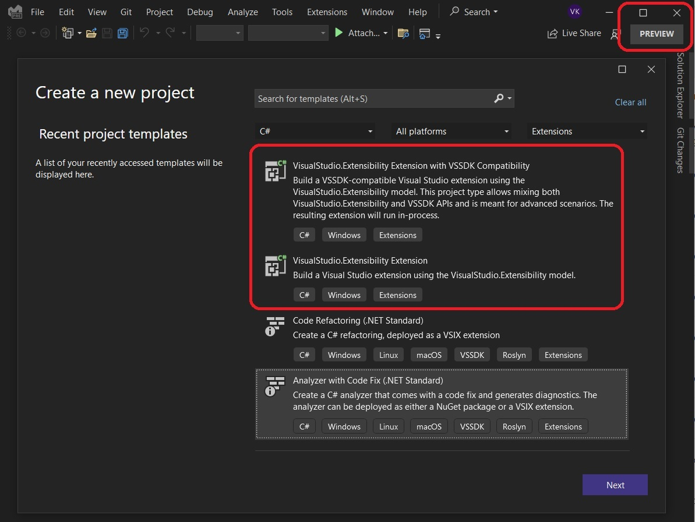

# LearnVsExt
Repository to learn Visual Studio Extension development. 


# Some references

## Book References.

1. https://github.com/Apress/visual-studio-extensibility-development
2. https://link.springer.com/book/10.1007/978-1-4842-5853-8
3. https://www.amazon.in/Visual-Studio-Extensibility-Development-Productivity/dp/1484258525
4. https://www.oreilly.com/library/view/visual-studio-extensibility/9781484258538/

## Cook Book reference

1. https://www.vsixcookbook.com/
2. https://github.com/VsixCommunity/docs/blob/main/docs/index.md

## Other references

1. https://visualstudio.microsoft.com/vs/features/extend/
2. https://learn.microsoft.com/en-us/visualstudio/extensibility
3. https://bideveloperextensions.github.io/features/VSIXextensionmodel/

## Useful Links

1. [VSIX Community on GitHub](https://github.com/VsixCommunity)
2. [VSIX Community Samples repo](https://github.com/VsixCommunity/Samples)
3. [Official VS SDK documentation](https://learn.microsoft.com/en-us/visualstudio/extensibility)
4. [VS SDK Samples repo](https://github.com/Microsoft/VSSDK-Extensibility-Samples)
5. [Extensibility chatroom on Gitter.im](https://gitter.im/Microsoft/extendvs)
6. [Extensibility Essentials](https://marketplace.visualstudio.com/items?itemName=MadsKristensen.ExtensibilityEssentials2022)


## Notes

1. If you get an error something like the following, 
> Extension 'AddMenuButtonVsMainMenuBar.d4c83f53-acb7-473a-8726-498e86ebae56' could not be found. Please make sure the extension has been installed.	AddMenuButtonVsMainMenuBar			

then take a look at the [so answer](https://stackoverflow.com/a/76134788/1977871).


```txt
C:\"Program Files"\"Microsoft Visual Studio"\2022\Professional\VSSDK\VisualStudioIntegration\Tools\Bin\CreateExpInstance.exe /Reset /VSInstance=17.0_c9ef2fd3 /RootSuffix=Exp && PAUSE
```

2. If you want to reset the experimental instance, do the following.


3. Also ensure you install [Clear MEF Component Cache](https://marketplace.visualstudio.com/items?itemName=MadsKristensen.ClearMEFComponentCache) extension. This is a part of [Extensibility Essentials](https://marketplace.visualstudio.com/items?itemName=MadsKristensen.ExtensibilityEssentials2022). The current latest version is 2022, and do check for the latest version
   1. Typical errors that can be solved by clearing the component cache are:
      1. Could not load package exception
      2. Could not load assembly exception
      3. Composition error when opening files
      4. Missing syntax highlighting of some languages in VS
 
   2. Clear Cache
      

   3. HEre we go


## A tutorial Series that I found on the net. 

1. From michaelscodingspot
   1. https://michaelscodingspot.com/visual-studio-2017-extension-development-tutorial-part-1/
   2. https://michaelscodingspot.com/visual-studio-2017-extension-development-tutorial-part-2-add-menu-item/
   3. https://michaelscodingspot.com/visual-studio-2017-extension-development-tutorial-part-3-add-context-menu-get-selected-code/
   4. https://michaelscodingspot.com/visual-studio-2017-extension-development-tutorial-part-4-show-a-popup-window/
   5. https://michaelscodingspot.com/visual-studio-2017-extension-development-tutorial-highlight-code-in-editor/
   6. https://michaelscodingspot.com/visual-studio-2017-extension-development-tutorial-part-6-follow-span-code-trackingspan/
   7. https://michaelscodingspot.com/visual-studio-2017-extension-tutorial-7-insert-buttons-text-characters-adornments/
   8. https://michaelscodingspot.com/visual-studio-2017-extension-tutorial-8-add-ui-in-the-indicator-margin-with-glyphs/
   9. Code Sample is here. https://github.com/michaelscodingspot/CodyDocs

2. Festive Editor 
   1. https://marketplace.visualstudio.com/items?itemName=MattLaceyLtd.FestiveEditor
   2. https://www.mrlacey.com/2020/11/a-festive-introduction-to-visual-studio.html
   3. https://github.com/mrlacey/FestiveEditor
   4. 

##  YouTube Playlist
1. https://www.youtube.com/playlist?list=PLReL099Y5nRdG2n1PrY_tbCsUznoYvqkS

2. https://www.youtube.com/watch?v=2c-4uZc0rq0

3. Writing Visual Studio Extensions with Mads - Writing your first extension
   1. https://www.youtube.com/watch?v=u0pRDM8qW04
   2. https://www.youtube.com/watch?v=Pk7jdsvEhfc
   3. https://www.youtube.com/watch?v=VVaGOxdvYSw
   4. https://www.youtube.com/watch?v=haTDm8Qkips
   5. https://www.youtube.com/watch?v=03M_4v0I1Gk
   6. https://www.youtube.com/playlist?list=PLReL099Y5nReXKzeX10TZF3BfLdOZXxix


## Notes about Useful extensions
1. The current latest version is 2022, and do check for the latest version
2. [Extensibility Essentials 2022](https://marketplace.visualstudio.com/items?itemName=MadsKristensen.ExtensibilityEssentials2022)
3. [Clear MEF Component Cache](https://marketplace.visualstudio.com/items?itemName=MadsKristensen.ClearMEFComponentCache) extension. 
   1. Typical errors that can be solved by clearing the component cache are:
      1. Could not load package exception
      2. Could not load assembly exception
      3. Composition error when opening files
      4. Missing syntax highlighting of some languages in VS 
4. 

## Blog posts
1. https://devblogs.microsoft.com/visualstudio/getting-started-writing-visual-studio-extensions/
2. https://devblogs.microsoft.com/visualstudio/writing-extensions-just-got-easier/


## To do 
1. https://learn.microsoft.com/en-us/visualstudio/extensibility/adding-a-menu-controller-to-a-toolbar

2. https://github.com/Microsoft/VSSDK-Extensibility-Samples

3. Need to be able to compile the following. 
   1. https://github.com/luminous-software/extensibility-logs
   2. https://marketplace.visualstudio.com/items?itemName=YannDuran.ExtensibilityLogs
   3. https://github.com/VsixCommunity/ExtensibilityEssentials/issues/18

4. Need to understand the following.
   1. [image service tools](https://learn.microsoft.com/en-us/visualstudio/extensibility/internals/image-service-tools)
   2. Also [image service and catalog](https://learn.microsoft.com/en-us/visualstudio/extensibility/image-service-and-catalog)

5. Need to understand CrispImage.
   1. https://github.com/amp2291/CrispImage-Test
   2. https://github.com/microsoft/PTVS/blob/main/Python/Product/EnvironmentsList/images/images.xaml
   3. https://stackoverflow.com/q/74840190/1977871
   4. https://stackoverflow.com/q/40677826/1977871
   5. https://developercommunity.visualstudio.com/t/extension-knowmonikers-image-is-not-showing-in-blu/1578087
   6. https://learn.microsoft.com/en-us/answers/questions/1134844/crispimage-draws-empty-area-when-using-vs-image-se?comment=question#newest-question-comment
   7. https://github.com/jfrog/jfrog-visual-studio-extension

6. Language Services
   1. https://learn.microsoft.com/en-us/visualstudio/extensibility/adding-an-lsp-extension
   2. https://github.com/Microsoft/VSSDK-Extensibility-Samples/tree/master/LanguageServerProtocol
   3. https://www.youtube.com/watch?v=hDSmUXK03L4
   4. https://www.youtube.com/watch?v=9XUAGspESzQ
   5. https://www.youtube.com/watch?v=Cw9qCsetpLU
7. Legacy Language Service
   1. https://learn.microsoft.com/en-us/previous-versions/visualstudio/visual-studio-2017/extensibility/internals/legacy-language-service-extensibility
   2. https://learn.microsoft.com/en-us/previous-versions/visualstudio/visual-studio-2017/extensibility/internals/walkthrough-creating-a-legacy-language-service
   3. https://learn.microsoft.com/en-us/previous-versions/visualstudio/visual-studio-2017/extensibility/internals/implementing-a-legacy-language-service2

8. What next?
   1. Need to try this. https://stackoverflow.com/questions/45863788/how-can-i-find-out-what-classification-types-are-registered-in-visual-studio
   2. https://www.codeproject.com/Articles/1245021/Extending-Visual-Studio-to-Provide-a-Colorful-Lang
   3. https://github.com/MicrosoftDocs/visualstudio-docs/blob/main/docs/extensibility/walkthrough-highlighting-text.md

9.  What is ITextView, IVsTextView and IWpfTextView?
10. What is IVsTextViewCreationListener and IWpfTextViewCreationListener?
11. IVsTextViewCreationListener vs IWpfTextViewCreationListener
12. IClassifier
    1.  https://github.com/microsoft/VSSDK-Extensibility-Samples/tree/master/ErrorList
    2.  https://github.com/microsoft/VSSDK-Extensibility-Samples/tree/master/Todo_Classification
    3.  https://github.com/microsoft/VSSDK-Extensibility-Samples/tree/master/Diff_Classifier
13. Need to look at 
    1.  https://learn.microsoft.com/en-us/visualstudio/extensibility/inside-the-editor
14. To do
    1.  https://github.com/microsoft/VSSDK-Extensibility-Samples/tree/master/AsyncToolWindow
    2.  End of fourth chapter in the book, ToolWindow and DTE object.
    3.  Need to understand AdornmentLayerDefinition
    4.  Need to understand PredefinedAdornmentLayers
15. Visual Studio Extension Preview
    1.  https://github.com/microsoft/VSExtensibility/
    2.  https://devblogs.microsoft.com/visualstudio/visualstudio-extensibility-preview-3/
    3.  https://marketplace.visualstudio.com/items?itemName=vsext.gladstone
16. Project Types to be explored. 
    
    1.  Community Type projects.
    
         
    
    2.  Textmate Grammer. 
    
         
    
    3.  Visual Studio Extensibility in Visual Studio 2022 Preview 17.8.0 Preview 1.0
    
         