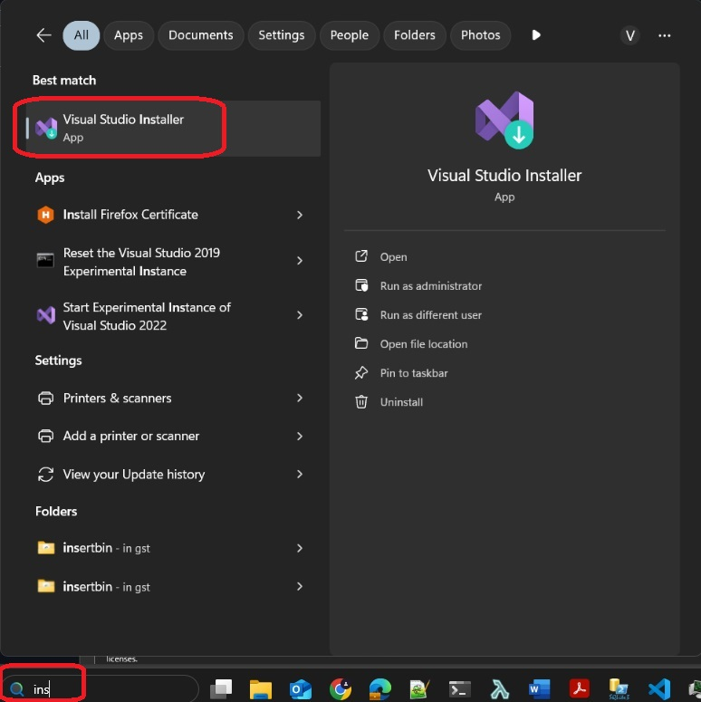
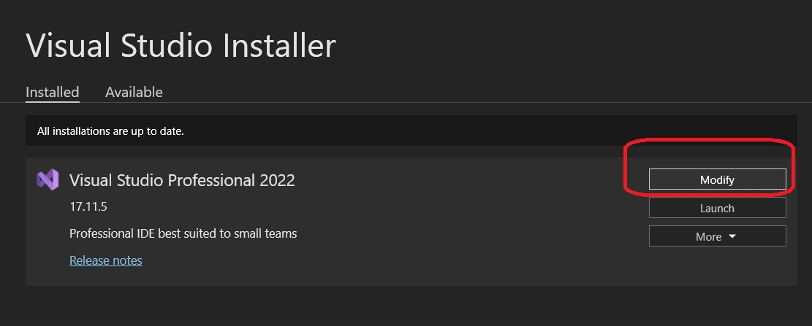
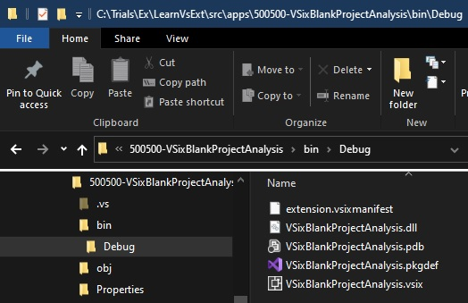
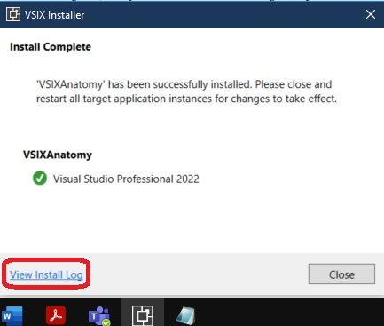

## Pre Requisites
1. Look for visual studio installer as follows.



Now modify it as follows.



2. The Visual Studio Extensibility Workload


3. The second one is a community driven extension called 
[Extensibility Essentials for Vs 2022](https://marketplace.visualstudio.com/items?itemName=MadsKristensen.ExtensibilityEssentials2022)

# New Project creation

1. Create a new project as follows.


2. Then build and observe the output.



3. Install the extension as follows.


4. See the logs.



5. Once installed, open the logs. You will see something like the following. The location of those logs will be - C:\Users\YourUserName\AppData\Local\Temp

> The extension has been installed to C:\Users\YourUserName\AppData\Local\Microsoft\VisualStudio\17.0_c9ef2fd3\Extensions\fyp2abr3.n2t\

   The first part is specific to the logged-in user and varies from machine to machine.
   This path is the local Appdata folder of the user and can be accessed directly by the
   environment variable %LOCALAPPDATA%.

   The second part is the relative part where the extensions are installed. The path
   comprises the folder structure, starting with Microsoft, which contains a folder named
   VisualStudio followed by the version of Visual Studio, which would vary for Visual
   Studio versions.

   The third and final part is a folder name that the VSIX installer generates for the
   extension to keep it unique

6. Go to that path and you will see


7. To uninstall 
   1. Visual Studio 2019: Extensions > Manage Extensions
   2. Visual Studio 2022: Extensions > Manage Extensions
   3. Then Go to the installed section and do the uninstall.
   


8. Take a look at the following as well
   1. https://stackoverflow.com/a/32672070/1977871
   2. https://stackoverflow.com/a/76146656/1977871

9. You may also want to run the following command to uninstall the extensions from Visual studio experimental or reset the extensions from Visual Studio Experimental 


10.  Finally after you uninstall, do take a look at the path C:\Users\YourUserName\AppData\Local\Microsoft\VisualStudio\17.0_c9ef2fd3\Extensions\fyp2abr3.n2t\

That should be gone now, after the uninstall.

11. Note the [Microsoft.VisualStudio.SDK](https://www.nuget.org/packages/microsoft.visualstudio.sdk) nuget package reference. This package is a meta package and contains the Visual Studio Software Development Kit (SDK). When you installed this NuGet package in a stand-alone project, it will bring down 150+ assemblies!!!


12. If you want to make it a Mef Component as follows. Solution Explorer -> Look for source.extension.vsixmanifest, right click -> Assets -> Edit.


## Building the project from command line.

```sh
devenv /build Debug ./VSixSdkProjectIntro.sln
```

1. You may get the following error when you run the above. 

```txt
Microsoft Visual Studio 2022 Version 17.11.5.                                                                                                                    
Copyright (C) Microsoft Corp. All rights reserved.                                                                                                               
Build started at 12:30 PM...                                                                                                                                     
1>------ Build started: Project: VSixSdkProjectIntro, Configuration: Debug Any CPU ------                                                                        
1>C:\Program Files\dotnet\sdk\8.0.403\Sdks\Microsoft.NET.Sdk\targets\Microsoft.PackageDependencyResolution.targets(266,5): 
error NETSDK1004: Assets file 'C:\Trials\Ex\LearnVsExt\src\apps\400510-VSixSdkProjectIntro\obj\project.assets.json' not found. 
Run a NuGet package restore to generate this file.                      
1>Done building project "VSixSdkProjectIntro.csproj" -- FAILED.                                                                                                  
========== Build: 0 succeeded, 1 failed, 0 up-to-date, 0 skipped ==========                                                                                      
========== Build completed at 12:31 PM and took 01.088 seconds ==========
```

2. So we need to restore the nuget packages.

```sh
nuget restore ./VSixSdkProjectIntro.sln
```

3. If you run the above, you may get nuget not found error.

4. So we need to install nuget command line as follows from powersehll(amy be elivated previlages). This will install at this location C:\Program Files\PackageManagement\NuGet\Packages on windows.

```ps
Install-Package NuGet.CommandLine
```

5. You may also have to add the nuget.exe location(in this case C:\Program Files\PackageManagement\NuGet\Packages\NuGet.CommandLine.6.11.1\tools) to the path variable. 


