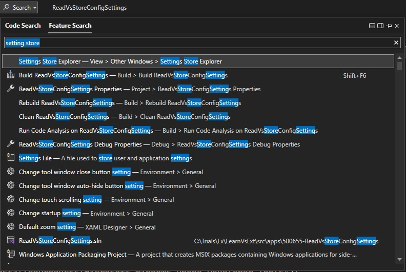
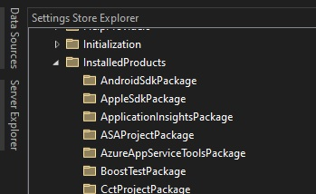
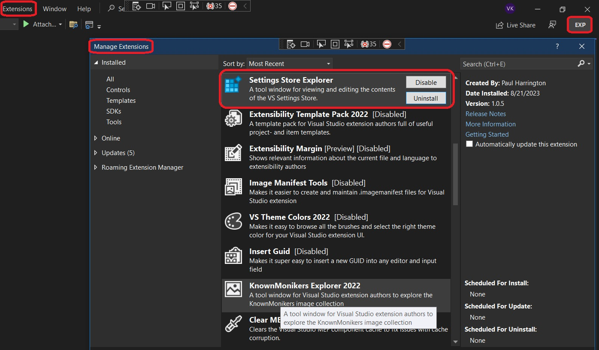
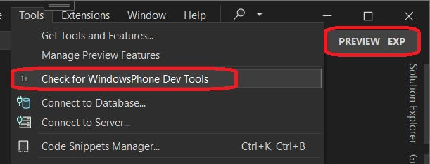
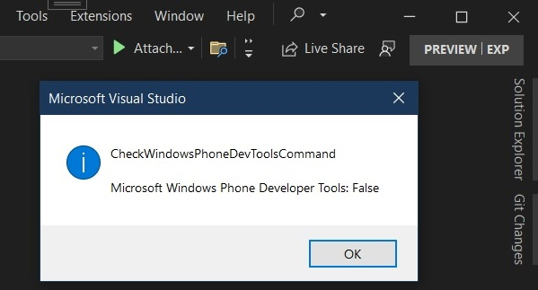
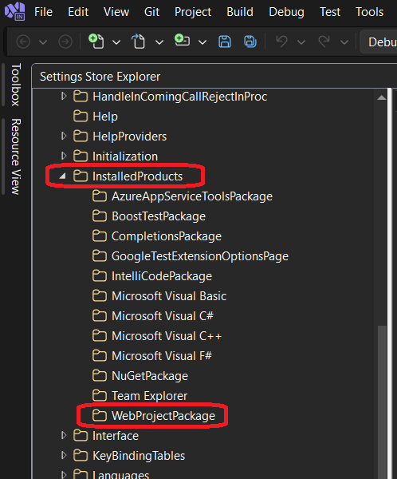
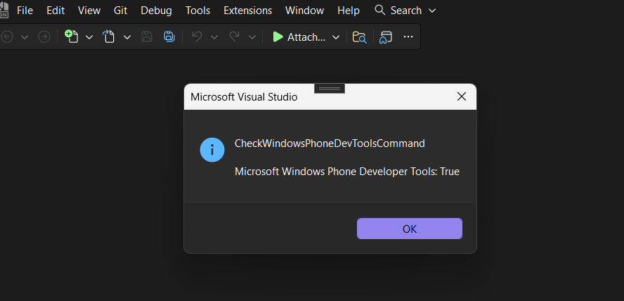

## Demos how to read Configuration settings, which are read-only Visual Studio and VSPackage settings

1. This is based on the article [**Using the Settings Store**](https://learn.microsoft.com/en-us/visualstudio/extensibility/using-the-settings-store)

2. Visual Studio Setting store is where Visual Studio, during and after installation, stores many of its settings. There is an excellent tool to visualize this. This tool comes in the form of [an extension and can be installed from here](https://marketplace.visualstudio.com/items?itemName=PaulHarrington.SettingsStoreExplorerPreview).

3. Once installed, open visual studio and search it as follows.



4. Look at installed Products.


## How this example is built.

1. This example is similar to the 400650-AddingSimpleCommand. 

2. The project is created exactly same way.

3. The key here is the [ShellSettingsManager](https://learn.microsoft.com/en-us/dotnet/api/microsoft.visualstudio.shell.settings.shellsettingsmanager) class. This is the gateway class to reach for the settings stored inside the Visual Studio 

5. This is a regular VSix project. 
   
6. Are the phone tools installed on your machine?



```cs
var settingsManager = new ShellSettingsManager(this.package);
var configurationSettingsStore = settingsManager.GetReadOnlySettingsStore(SettingsScope.Configuration);
var arePhoneToolsInstalled = configurationSettingsStore.CollectionExists(@"InstalledProducts\Microsoft Windows Phone Developer Tools");
```

7. In the exp instance, the SettingStoreExplorer is disabled by default. So go to extensions, Manage Extensions.
Then installed.


8. Executing the command


9.  The message box



10. Now modify the CollectionExists method call with the following - `@"InstalledProducts\WebProjectPackage"`



```cs
var arePhoneToolsInstalled = configurationSettingsStore.CollectionExists(@"InstalledProducts\WebProjectPackage");
```

11. Now ResetExperimntalInstance, build and re run. This time you will get 




