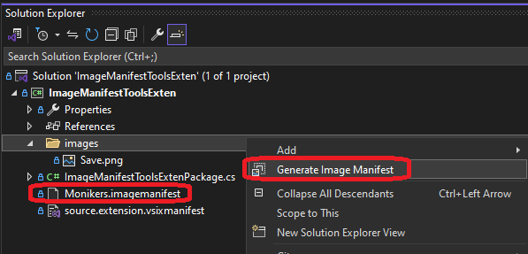
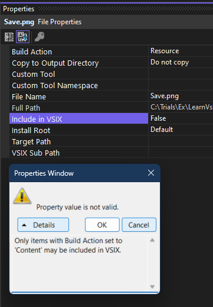

## Introducing Image Manifest Tools Extension

1. Create a new VSIX package. Then add a new folder images. 

2. Then add a png to the images folder. Look at the earlier example(400725-ImageManifestToolsExten). [400725-ImageManifestToolsExten](https://github.com/AvtsVivek/LearnVsExt/tree/main/src/tasks/400705-AddingMonikerIcon)
   1. See the steps how to add a png file. See the following step.
   2. From the known monikers you can select one, and you can even export, it as png, jpg or gif to any location on the disc 

3. Include the added png file into the project. Then from the image properties, set include in VSIX to be true.

4. Next right click the images folder, and [generate the image manifest](https://github.com/madskristensen/MonikerManifestTools?tab=readme-ov-file#generate-image-manifest) as follows.

6. Ensure [Image Manifest Tools](https://marketplace.visualstudio.com/items?itemName=MadsKristensen.ImageManifestTools) is installed. Also see this [git hub link](https://github.com/madskristensen/MonikerManifestTools)

7. This should be part of [Extensibility Essentials pack](https://marketplace.visualstudio.com/items?itemName=MadsKristensen.ExtensibilityEssentials2022).

8. The above `Image Manifest tool`, Makes it easier to create and maintain .imagemanifest files for Visual Studio extension. The `.imagemanifest` file thats generated for those images, can be used with the Visual Studio Image Service.

9. This tool wraps the [ManifestFromResources.exe tool into an easy to use command](https://learn.microsoft.com/en-us/visualstudio/extensibility/internals/manifest-from-resources) from within the Visual Studio.

10. Right click and take a look at the properties of the save.png file. Irrespecitve of weather Include in VSIX is true or false, you can create a imagemanifest file. And the image manifest file will be identical irrespecitve of weather Include in VSIX is true or false.
   
   

11. If you want to switch Include in VSIX to true, then first make the build action to content. Else you will get the following error.

10. The generated .imagemanifest file should be included in and deployed as a part of a Visual Studio extension (.vsix).

11. So once the imagemanifest file is created either by using ManirestFromResouces(subsequent example) or ImageManifestToolsExtension, you can go to the next step of Manifest to code in the subsequent example. Then we can aclutally use the image in the vs extension.

## References 

1. [image service tools](https://learn.microsoft.com/en-us/visualstudio/extensibility/internals/image-service-tools)

2. Also [image service and catalog](https://learn.microsoft.com/en-us/visualstudio/extensibility/image-service-and-catalog)

3. https://marketplace.visualstudio.com/items?itemName=MadsKristensen.ImageManifestTools
