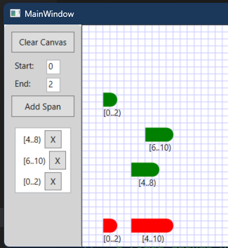

## Objective

1. Introduces `Span` and `NormalizedSpanCollection` 

2. For the full article, [click here](..\220560-TextBufferIntro\1-ITextBuffer.md)

3. This example, is a wpf example and not an extension.

## Build and Run
1. Well, go ahead.

## Notes.
1. A [Microsoft.Visualstudio.Text.Span](https://learn.microsoft.com/en-us/dotnet/api/microsoft.visualstudio.text.span) is a very simple concept. Its a struct.

2. An immutable integer interval that describes a range of values from Start to End that is closed on the left and open on the right: [Start .. End). A span is usually applied to an [ITextSnapshot](https://learn.microsoft.com/en-us/dotnet/api/microsoft.visualstudio.text.itextsnapshot) to denote a span of text, but it is independent of any particular text buffer or snapshot.

3. Its simply a number range. Thats all. The problem with using such types (Span and Simple Int) is that they are detached from the specific text, and if we have calculated the position or interval for one snapshot, they may indicate something completely different or be invalid for another. In other words, a Position or Span only makes sense in the *context* of a particular [ITextSnapshot](https://learn.microsoft.com/en-us/dotnet/api/microsoft.visualstudio.text.itextsnapshot). 

## Reference.
1. https://mihailromanov.wordpress.com/2021/11/05/json-on-steroids-2-2-visual-studio-editor-itextbuffer-and-related-types

