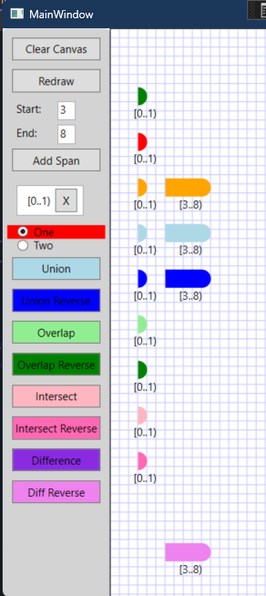

## Objective

1. An earlier example introduces `Span` and `NormalizedSpanCollection` 

2. This will introduces some operatioins on `NormalizedSpanCollection`

3. This example, is a wpf example and not an extension.

## Build and Run
1. Well, go ahead.

## Notes.

## Reference.
1. https://mihailromanov.wordpress.com/2021/11/05/json-on-steroids-2-2-visual-studio-editor-itextbuffer-and-related-types

