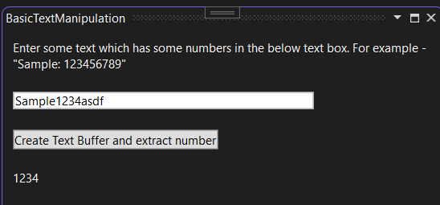
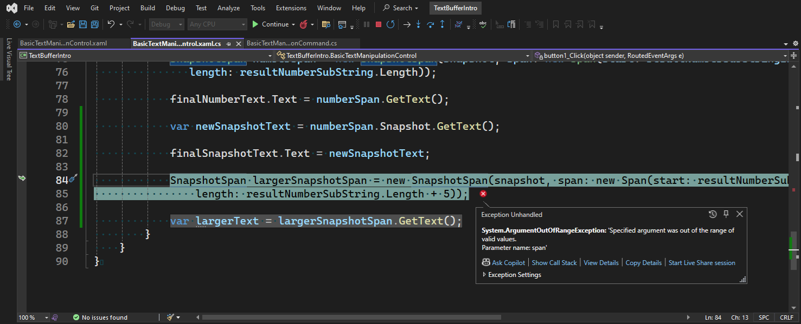

## Objective

1. Introduces `ITextBuffer`, `ITextBufferFactoryService`, `ITextSnapshot`, `SnapshotSpan`

2. For the full article, [click here](1-ITextBuffer.md)

## Notes

1. A [Microsoft.Visualstudio.Text.Span](https://learn.microsoft.com/en-us/dotnet/api/microsoft.visualstudio.text.span) is a very simple concept. Its a struct.

2. An immutable integer interval that describes a range of values from Start to End that is closed on the left and open on the right: [Start .. End). A span is usually applied to an [ITextSnapshot](https://learn.microsoft.com/en-us/dotnet/api/microsoft.visualstudio.text.itextsnapshot) to denote a span of text, but it is independent of any particular text buffer or snapshot.

3. Its simply a number range. Thats all. The problem with using such types (Span and Simple Int) is that they are detached from the specific text, and if we have calculated the position or interval for one snapshot, they may indicate something completely different or be invalid for another. In other words, a Position or Span only makes sense in the *context* of a particular [ITextSnapshot](https://learn.microsoft.com/en-us/dotnet/api/microsoft.visualstudio.text.itextsnapshot). 

4. Therefore, the following two types have been added:

   1. [SnapshotPoint](https://docs.microsoft.com/en-us/dotnet/api/microsoft.visualstudio.text.snapshotpoint)
   2. [SnapshotSpan](https://docs.microsoft.com/en-us/dotnet/api/microsoft.visualstudio.text.snapshotspan)

Essentially, these are structures that contain the position (or interval) and the pointer to the Snapshot for which they were obtained. In addition, they implement methods of comparison and manipulation (for example, to shift a position by a given distance) with a check for admissibility (for example, for not going beyond the border of the Snapshot).

## Build and Run
1. Reset Visual Studio Exp instance and then Launch it.


2. View -> Other Windows -> BasicTextManipulation



3. Key in some text with some digits and click the button.

## Notes

1. We get `ITextBuffer`, from `ITextBufferFactoryService`, 

2. And `ITextSnapshot`, from `ITextBuffer`.

3. `SnapshotSpan` is a subset of `Snapshot`.

4. In this example, we get the `ITextBuffer` from `ITextBufferFactoryService`. In a subsequent example, we get the same `ITextBuffer` from `IWpfTextView`. So in the examples that follow, `TextViews` are introduced. Then we will revisit these `TextBuffer`, snapshot and so on. 

5. When you create a SnapshotSpan, the range or the span should be a subset of the text range. If not, then it will throw an exception as follows.



6. So here the span overflows the last char of the sttring and so the exception.

```cs
SnapshotSpan largerSnapshotSpan = new SnapshotSpan(snapshot, span: new Span(start: resultNumberSubStringIndex,
    length: resultNumberSubString.Length + 5));

var largerText = largerSnapshotSpan.GetText();
```

7. 


## Reference.
1. https://mihailromanov.wordpress.com/2021/11/05/json-on-steroids-2-2-visual-studio-editor-itextbuffer-and-related-types

2. For the full article see the following.
   1. [AboutVsExtensions](../900930-JsonEditor/Articles/1-AboutVsExtensions.md)
   2. [VsEditor-ContentTypes](../900930-JsonEditor/Articles/2-VsEditor-ContentTypes.md)
   3. [ITextBuffer](../900930-JsonEditor/Articles/3-ITextBuffer.md)
   4. [Tags-Classifiers-Part-1](../900930-JsonEditor/Articles/4-Tags-Classifiers-Part-1.md)
   5. [Tags-Classifiers-Part-2](../900930-JsonEditor/Articles/5-Tags-Classifiers-Part-2.md)
   6. [Tags-Classifiers-Part-3](../900930-JsonEditor/Articles/6-Tags-Classifiers-Part-3.md)   
   7. [JSonParser](../900930-JsonEditor/Articles/7-JSonParser.md)

