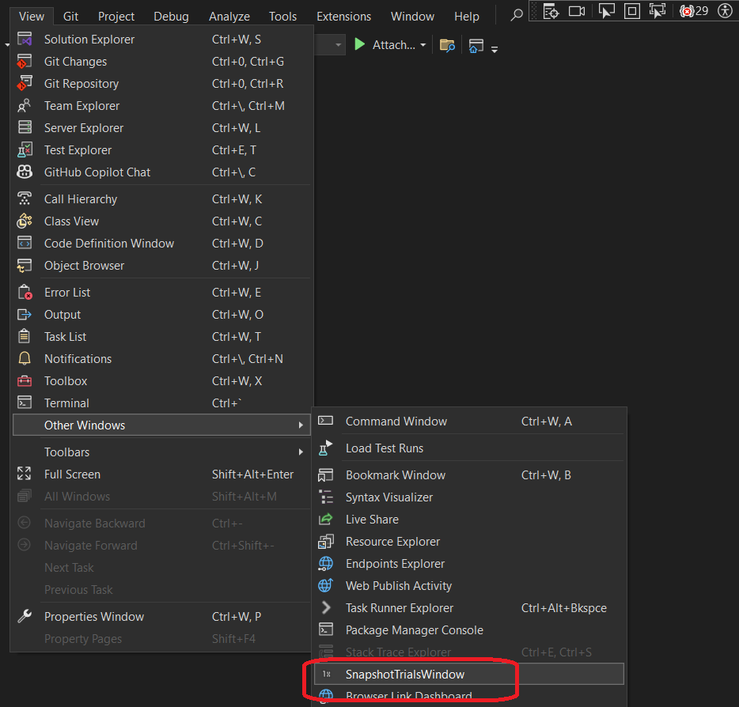

## Objective

1. Introduces `SnapshotSpan`

2. For the full article, [click here](../220555-TextBufferIntro/1-ITextBuffer.md)

## Notes

1. We get `ITextBuffer`, from `ITextBufferFactoryService`, 

2. And `ITextSnapshot`, from `ITextBuffer`.

3. `SnapshotSpan` is a subset of `Snapshot`.

## Build and Run
1. Reset Visual Studio Exp instance and then Launch it.

2. View -> Other Windows -> SnapshotSpanIntro

3. 

## Reference.
1. https://mihailromanov.wordpress.com/2021/11/05/json-on-steroids-2-2-visual-studio-editor-itextbuffer-and-related-types

3. For the full article see the following.
   1. [AboutVsExtensions](../900930-JsonEditor/Articles/1-AboutVsExtensions.md)
   2. [VsEditor-ContentTypes](../900930-JsonEditor/Articles/2-VsEditor-ContentTypes.md)
   3. [ITextBuffer](../900930-JsonEditor/Articles/3-ITextBuffer.md)
   4. [Tags-Classifiers-Part-1](../900930-JsonEditor/Articles/4-Tags-Classifiers-Part-1.md)
   5. [Tags-Classifiers-Part-2](../900930-JsonEditor/Articles/5-Tags-Classifiers-Part-2.md)
   6. [Tags-Classifiers-Part-3](../900930-JsonEditor/Articles/6-Tags-Classifiers-Part-3.md)   
   7. [JSonParser](../900930-JsonEditor/Articles/7-JSonParser.md)

