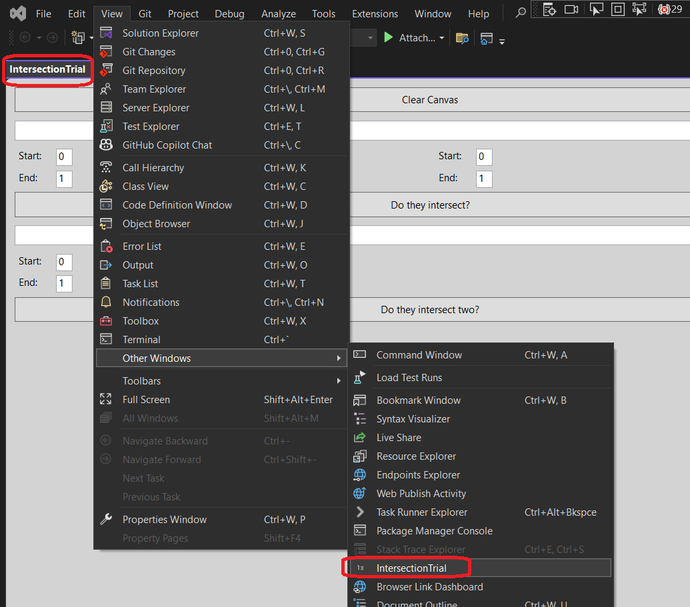
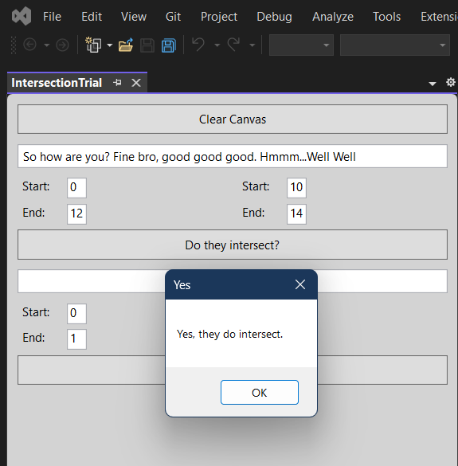
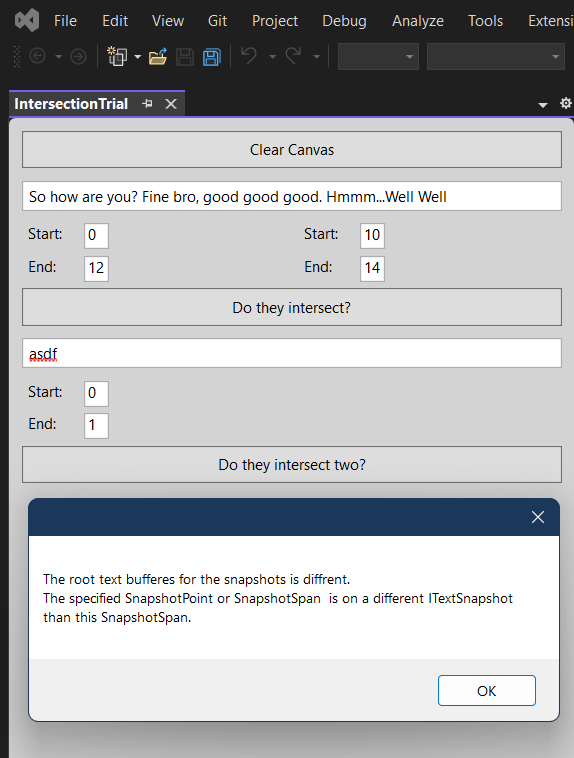

## Objective

1. Introduces `SnapshotSpan` IntersectsWith method.

## Build and Run
1. Reset Visual Studio Exp instance and then Launch it.

2. View -> Other Windows -> IntractionTrial

3. Same buffer

4. Different buffer

## Notes

1. When the buffers differ, then exception is thrown. 

