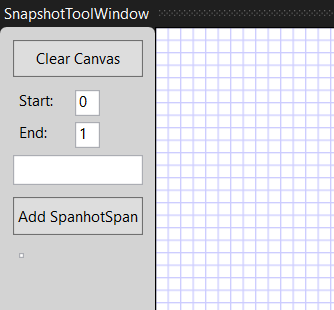
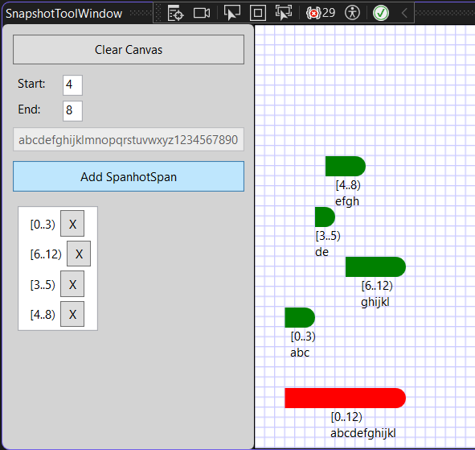
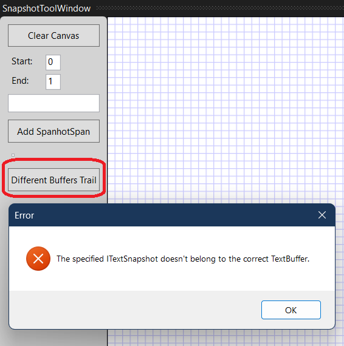

## Objective

1. Introduces `ITextSnapshot`, `SnapshotSpan`, 

2. For the full article, [click here](..\220560-TextBufferIntro\1-ITextBuffer.md)


## Notes

1. Note that the [SnapshotSpan can be cast or convert to Span](https://learn.microsoft.com/en-us/dotnet/api/microsoft.visualstudio.text.snapshotspan#operators)

2. So you can have something like the following. 

```cs
ITextSnapshot currentTextSnapshot = _textBuffer.CurrentSnapshot;
SnapshotSpan snapShotSpan = new SnapshotSpan(currentTextSnapshot, span);
Span spanTemp = (Span)(snapShotSpan);
```

3. Similarly you can cast [NormalizedSnapshotSpanCollection to NormalizedSpanCollection](https://learn.microsoft.com/en-us/dotnet/api/microsoft.visualstudio.text.normalizedsnapshotspancollection#operators). 


## Build and Run
1. Reset Visual Studio Exp instance and then Launch it.


2. View -> Other Windows -> SnapshotToolWindow and then make it full screen.



3. Here we have it.



4. Click the Different Buffer Trail.



## Notes

1. We get `ITextBuffer`, from `ITextBufferFactoryService`, 
2. And `ITextSnapshot`, from `ITextBuffer`.
3. `SnapshotSpan` is a subset of `Snapshot`.
4. In this example, we get the `ITextBuffer` from `ITextBufferFactoryService`. In a subsequent example, we get the same `ITextBuffer` from `IWpfTextView`. So in the examples that follow, `TextViews` are introduced. Then we will revisit these `TextBuffer`, snapshot and so on. 


## Reference.
1. https://mihailromanov.wordpress.com/2021/11/05/json-on-steroids-2-2-visual-studio-editor-itextbuffer-and-related-types


2. For the full article see the following.
   1. [AboutVsExtensions](../900930-JsonEditor/Articles/1-AboutVsExtensions.md)
   2. [VsEditor-ContentTypes](../900930-JsonEditor/Articles/2-VsEditor-ContentTypes.md)
   3. [ITextBuffer](../900930-JsonEditor/Articles/3-ITextBuffer.md)
   4. [Tags-Classifiers-Part-1](../900930-JsonEditor/Articles/4-Tags-Classifiers-Part-1.md)
   5. [Tags-Classifiers-Part-2](../900930-JsonEditor/Articles/5-Tags-Classifiers-Part-2.md)
   6. [Tags-Classifiers-Part-3](../900930-JsonEditor/Articles/6-Tags-Classifiers-Part-3.md)   
   7. [JSonParser](../900930-JsonEditor/Articles/7-JSonParser.md)


