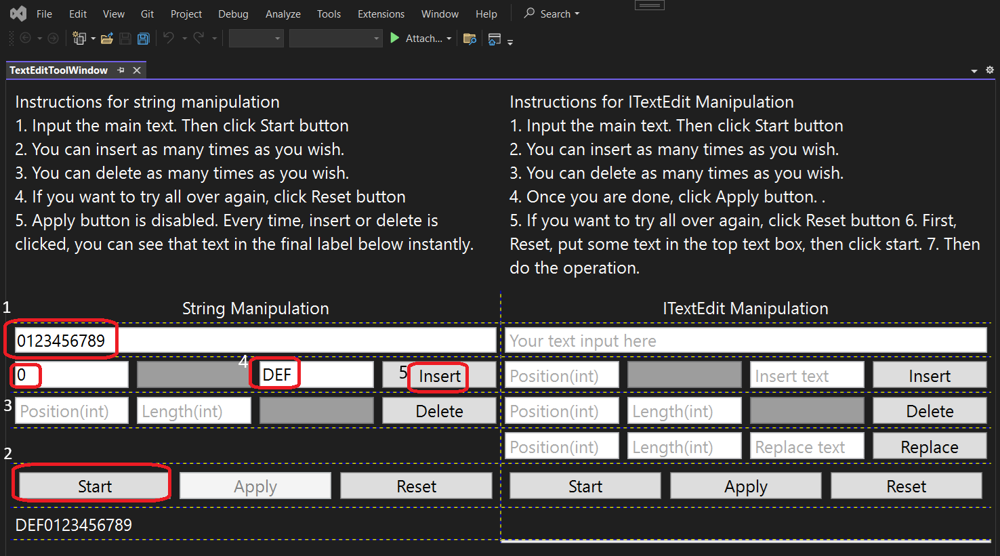
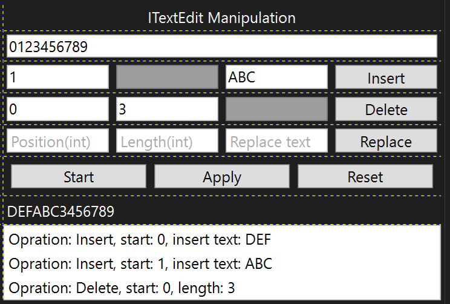
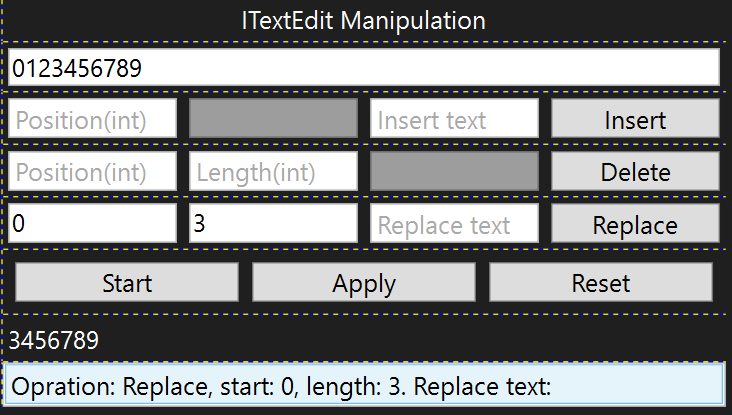
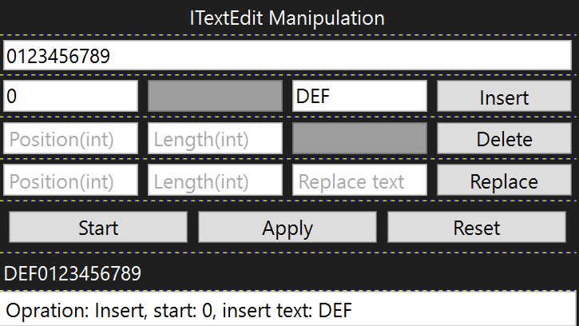
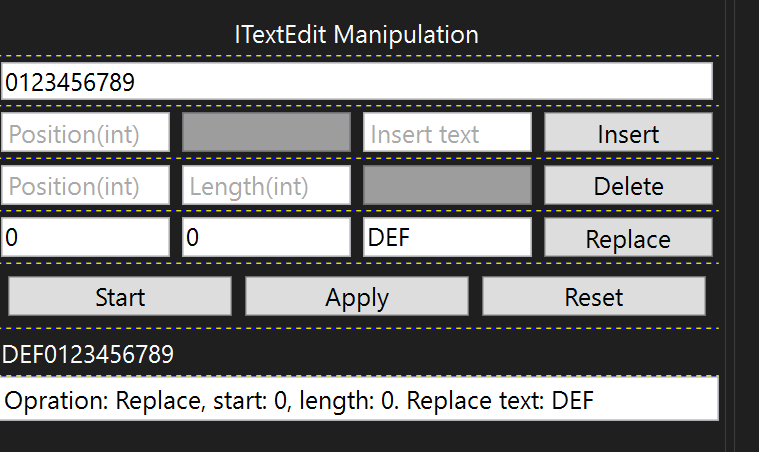
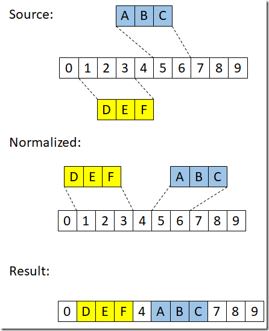
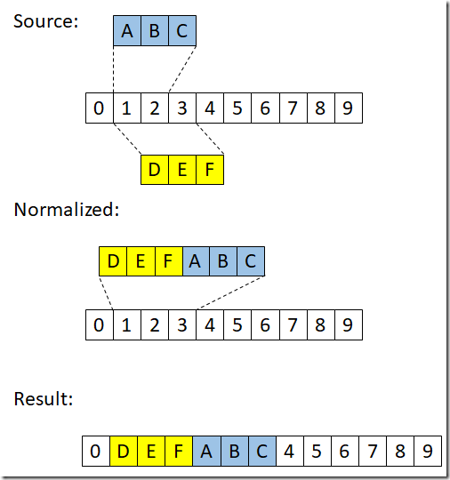
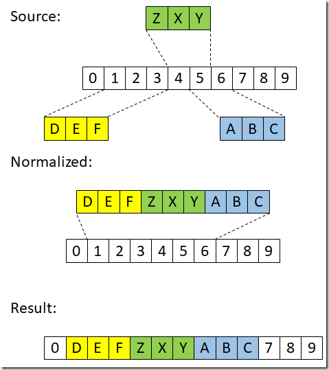

## Objective

1. The earlier example(a pure wpf application) is not working. The component model object is obtained only in Visual Studio setting. We need to start a Visual Studio Extension project. Here it is.

2. This example introduces [ITextEdit](https://learn.microsoft.com/en-us/dotnet/api/microsoft.visualstudio.text.itextedit) 


## Build and Run

1. Reset Visual Studio Exp instance and then Launch it.


2. View -> Other Windows -> Look for TextEditToolWindow



3. Instructions for string manipulation(the left side column) 
   1. Input the main text. Then click Start button 
   2. Then to insert text, give position the text and then click insert.
   3. You can insert as many times as you wish. 
   4. You can delete as many times as you wish. 
   5. If you want to try all over again, click Reset button
   6. For string manipulation, Apply button is disabled. Every time, insert or delete is clicked, you can see that text in the final label below instantly.

4. Try the following for string manipulation, using the above UI.

```cs
var text = "0123456789";
text = text.Insert(0, "DEF");
text = text.Insert(1, "ABC");
text = text.Remove(0, 3);
```

The end result should be `CEF0123456789`


5. Instructions for ITextEdit Manipulation 
   1. Input the main text. Then click Start button 
   2. Similar to string manipulation, you can insert as many times as you wish. 
   3. You can delete as many times as you wish. 
   4. Once you are done, click Apply button.
   5. If you want to try all over again, click Reset button
   6. First, Reset, put some text in the top text box, then click start.
   7. Then do the operation such as insert, delete, or replace. Then click apply.

6. Try the folloing.

```cs
var text = "0123456789";
var textBuffer = textBufferFactoryService
    .CreateTextBuffer(text, textBufferFactoryService.PlaintextContentType);
var e = textBuffer.CreateEdit();
e.Insert(0, "DEF");
e.Insert(1, "ABC");
e.Delete(0, 3);
e.Apply(); 
```



You should get `DEFABC3456789`

7. Inside of the `ITextEdit` object, the deleting and inserting operations are converted to a replacement operation as follows.

```txt
Delete(position, length) –> Replace(position, length, “”)
Insert(position, “text”) –> Replace(position, 0, “text”) 
```

8. So try this delete operation `e.Delete(0, 3);` and then with replace operation 0, 3 and empty space(dont put any replace text) 



9. Similarly try out Insert



10. Now insert using replace.



11. Understand and try the following as well.

```cs
Replace(5, 2, “ABC”);
Replace(1, 3, “DEF”);
```



```cs
Replace(1, 2, “ABC”);
Replace(1, 3, “DEF”);
```


```cs	
Replace(1, 3, “DEF”);
Replace(1, 2, “ABC”);
```



```cs
Replace(5, 2, “ABC”);
Replace(1, 3, “DEF”);
Replace(4, 2, “ZXY”);
```




## Reference.

1. https://mihailromanov.wordpress.com/2021/11/05/json-on-steroids-2-2-visual-studio-editor-itextbuffer-and-related-types

2. https://learn.microsoft.com/en-us/visualstudio/extensibility/inside-the-editor#itextedit-textversion-and-text-change-notifications

3. For the full article,
   1. [AboutVsExtensions](../900930-JsonEditor/Articles/1-AboutVsExtensions.md)
   2. [VsEditor-ContentTypes](../900930-JsonEditor/Articles/2-VsEditor-ContentTypes.md)
   3. [ITextBuffer](../900930-JsonEditor/Articles/3-ITextBuffer.md)
   4. [Tags-Classifiers-Part-1](../900930-JsonEditor/Articles/4-Tags-Classifiers-Part-1.md)
   5. [Tags-Classifiers-Part-2](../900930-JsonEditor/Articles/5-Tags-Classifiers-Part-2.md)
   6. [Tags-Classifiers-Part-3](..\900930-JsonEditor\Articles\6-Tags-Classifiers-Part-3.md)   
   7. [JSonParser](../900930-JsonEditor/Articles/7-JSonParser.md)


