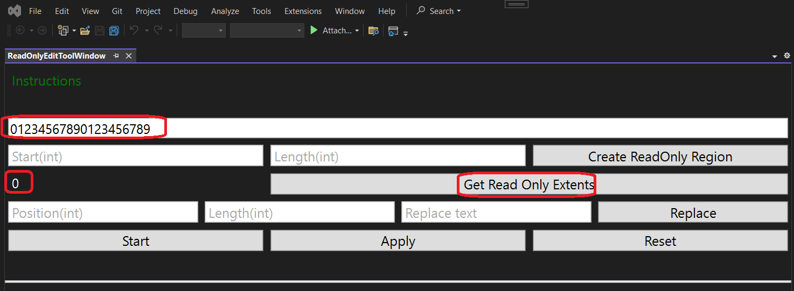
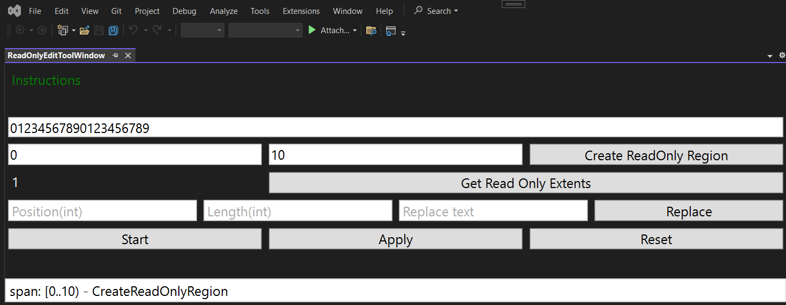
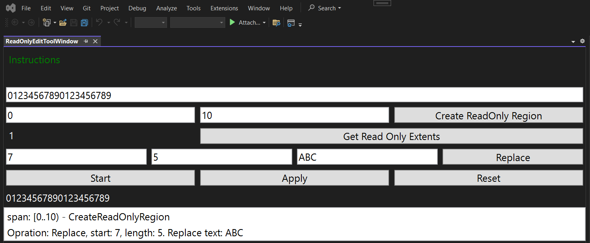
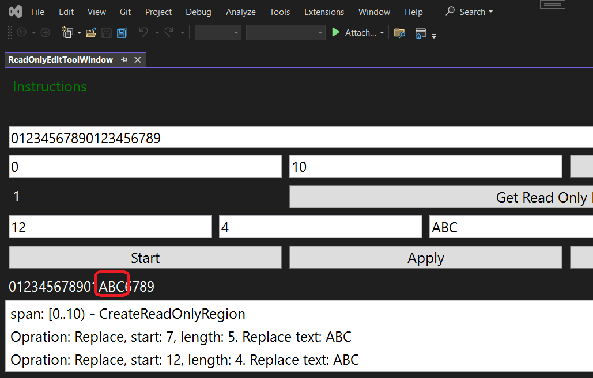
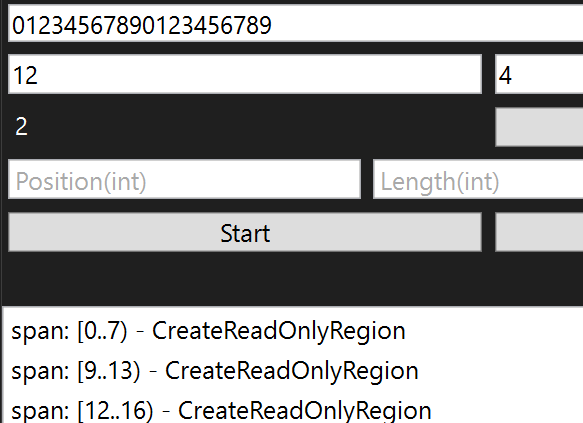

## Objective

1. Introduces IReadOnlyRegionEdit

## Notes
1. The following are the steps.

   1. Get the ITextBufferFactoryService
```cs
_textBufferFactoryService = componentModel.GetService<ITextBufferFactoryService>();
```

   2. Next get ITextBuffer from ITextBufferFactoryService
```cs
_textBuffer = _textBufferFactoryService.CreateTextBuffer(inputText, _textBufferFactoryService.PlaintextContentType);
```

   3. Get ITextEdit from text buffer.
```cs
_textEdit = _textBuffer.CreateEdit();
```

   4. Now you can use Replace
```cs
_textEdit.Replace(startPosition: position, charsToReplace: length, replaceWith: replaceString);
```

   5. Then we can get the current snapshot. 
```cs
var currentSnapshot = _textBuffer.CurrentSnapshot;
```

   6. Also we get the IReadOnlyRegionEdit from text buffer as follows.
```cs
IReadOnlyRegionEdit readOnlyRegionEdit = _textBuffer.CreateReadOnlyRegionEdit();
```

   7. Also we get the IReadOnlyRegionEdit from text buffer as follows.

```cs
var span = new Span(spanStart, spanLength);
_readOnlyRegionEdit.CreateReadOnlyRegion(span);
```


## Build and Run

1. Reset Visual Studio Exp instance and then Launch it.


1. View -> Other Windows -> Look for ReadOnlyEditToolWindow

2. Enter text say `01234567890123456789` 20 chars in the top text box. Click the `Get Read Only Extents` button. You should now see 0 read only extents.



3. Then click the Start button. Then put 0 and lenght 10 and click `Create ReadOnly Region` button. 



4. Now try to edit by replacing some text, whose span overlaps with the Readonly region. So put the position as say 7 and length say 5, and replace text say ABC, click `Replace` and then click `Apply`. Notice that there is no change to the text. This is because the edit overlaps with ReadOnly region. Read only regions do not allow edits.



5. Now try an edit in 11 till 20 space. 



6. Reset, and start over again. This time, create three readonly regions of which, the second and third overlap as follows. So although there are three regions, only two are readonly regions.



1. 

## Reference.

1. https://mihailromanov.wordpress.com/2021/11/05/json-on-steroids-2-2-visual-studio-editor-itextbuffer-and-related-types

2. https://learn.microsoft.com/en-us/visualstudio/extensibility/inside-the-editor#itextedit-textversion-and-text-change-notifications

3. Here we go...
