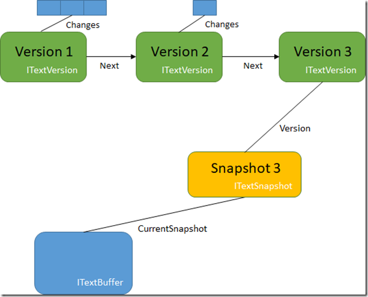
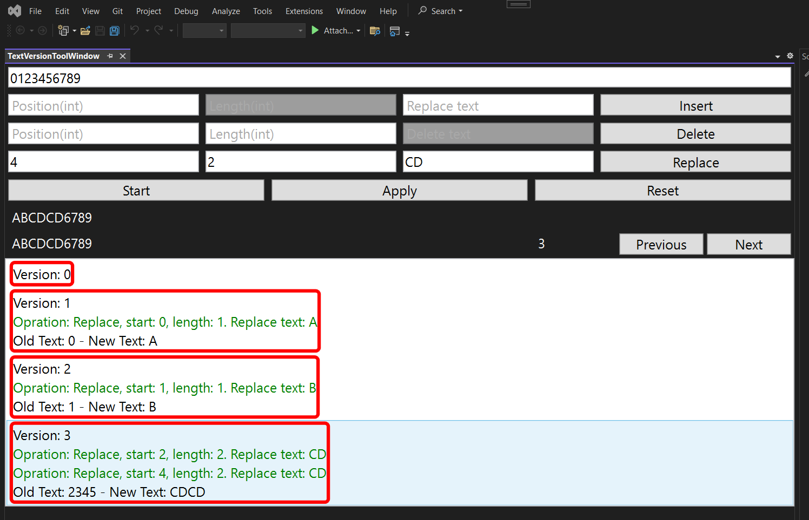

## Objective

1. Introduces ITextVersion

2. Take a look at [this link](https://mihailromanov.wordpress.com/2021/11/05/json-on-steroids-2-2-visual-studio-editor-itextbuffer-and-related-types/), enable google translate from Russian to English. Then look for "Versioning, history of changes and tracking". And check out the following.

```txt
It turns out that you can't just access the history of changes at any time – if you need it, then you need to save a link to the reference point you need in advance. On the other hand, this model (at least in theory – if no one else references the history) is to clear the memory occupied by the history in the GC.

Another important point is read-only history, i.e. these interfaces do not offer you an API for performing Undo. You won't even be able to change CurrentSnapshot to your previously saved CurrentSnapshot.
```

3. In the above find the following diagram.




## Build and Run

1. Reset Visual Studio Exp instance and then Launch it.


1. View -> Other Windows -> Look for ReadOnlyEditToolWindow

2. Enter text say `0123456789` 10 chars in the top text box. Then do as the following diagram suggests.



4. Try redo and undo. 

## Notes
1. The following are the steps.

   1. Get the ITextBufferFactoryService
```cs
_textBufferFactoryService = componentModel.GetService<ITextBufferFactoryService>();
```

   2. Next get ITextBuffer from ITextBufferFactoryService
```cs
_textBuffer = _textBufferFactoryService.CreateTextBuffer(inputText, _textBufferFactoryService.PlaintextContentType);
```

   3. Get ITextEdit from text buffer.
```cs
_textEdit = _textBuffer.CreateEdit();
```

   4. Now you can use Replace
```cs
_textEdit.Replace(startPosition: position, charsToReplace: length, replaceWith: replaceString);
```

   5. Then we can get the current snapshot. 
```cs
var currentSnapshot = _textBuffer.CurrentSnapshot;
```

   6. Also we get the IReadOnlyRegionEdit from text buffer as follows.
```cs
IReadOnlyRegionEdit readOnlyRegionEdit = _textBuffer.CreateReadOnlyRegionEdit();
```

   7. Also we get the IReadOnlyRegionEdit from text buffer as follows.
```cs
IReadOnlyRegionEdit readOnlyRegionEdit = _textBuffer.CreateReadOnlyRegionEdit();
```


## Reference.

1. https://mihailromanov.wordpress.com/2021/11/05/json-on-steroids-2-2-visual-studio-editor-itextbuffer-and-related-types

2. https://learn.microsoft.com/en-us/visualstudio/extensibility/inside-the-editor#itextedit-textversion-and-text-change-notifications

3. [Text buffer](../900930-JsonEditor/Articles/3-ITextBuffer.md)

