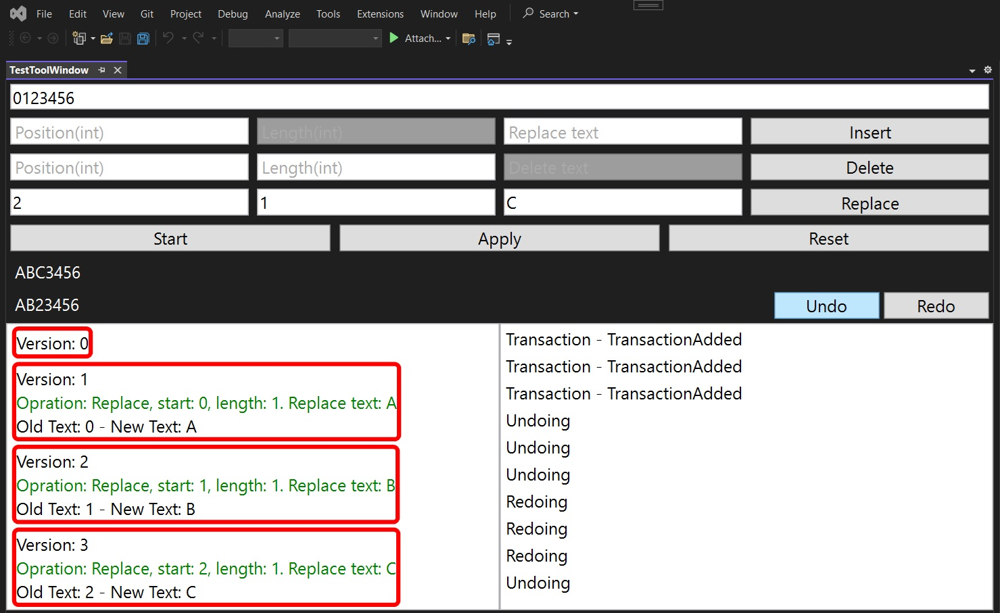
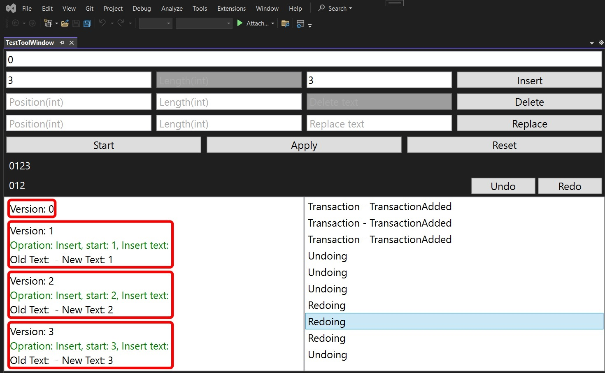
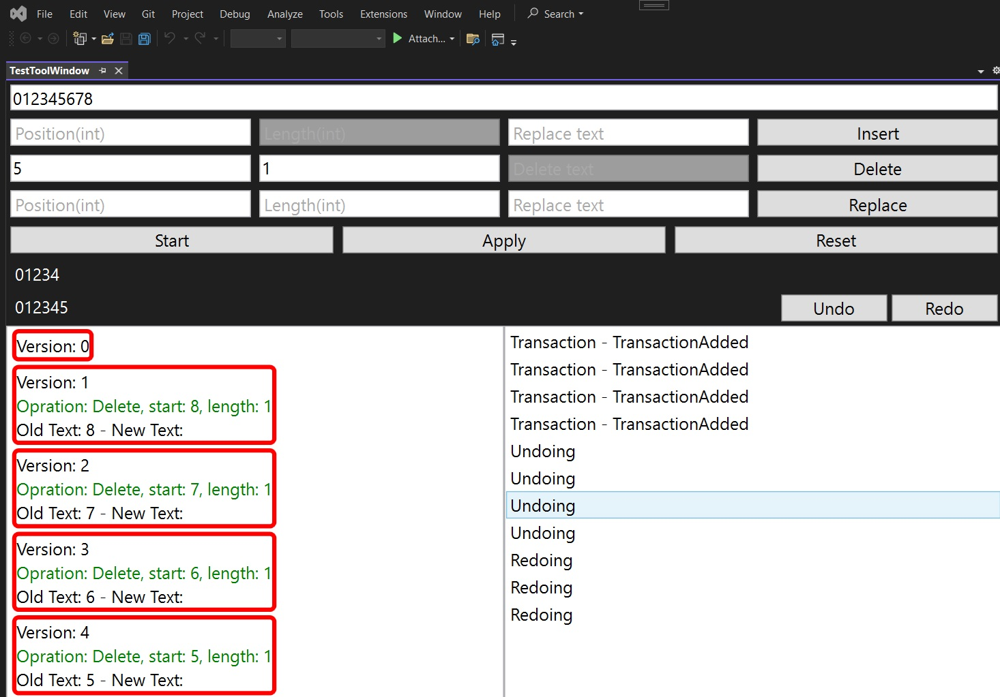

## Objective

1. Introduces [`ITextBufferUndoManager`](https://learn.microsoft.com/en-us/dotnet/api/microsoft.visualstudio.text.operations.itextbufferundomanager), [`ITextBufferUndoManagerProvider`](https://learn.microsoft.com/en-us/dotnet/api/microsoft.visualstudio.text.operations.itextbufferundomanagerprovider), [`ITextUndoHistory`](https://learn.microsoft.com/en-us/dotnet/api/microsoft.visualstudio.text.operations.itextundohistory), 

2. The following props behave strangely.

ITextUndoTransaction textUndoTransaction = textBufferUndoHistory.CurrentTransaction; // Gives null
ITextUndoTransaction lastUndoTransaction = textBufferUndoHistory.LastUndoTransaction;// Gives Exception
ITextUndoTransaction lastRedoTransaction = textBufferUndoHistory.LastRedoTransaction;// Gives Exception

## Notes

1. Undo and Redo happens as follows.

```cs
_textBufferUndoManagerProvider = componentModel.GetService<ITextBufferUndoManagerProvider>();
_textBufferUndoManager = _textBufferUndoManagerProvider.GetTextBufferUndoManager(_textBuffer);

_textBufferUndoManager.TextBufferUndoHistory.UndoRedoHappened += TextBufferUndoHistory_UndoRedoHappened;
_textBufferUndoManager.TextBufferUndoHistory.UndoTransactionCompleted += TextBufferUndoHistory_UndoTransactionCompleted;

var textBufferUndoHistory = _textBufferUndoManager.TextBufferUndoHistory;

textBufferUndoHistory.Undo(1);
// OR
textBufferUndoHistory.Redo(1);

```

## Build and Run

1. Reset Visual Studio Exp instance and then Launch it.


1. View -> Other Windows -> Look for TestToolWindow

2. Enter text say `0123456` 7 chars in the top text box. Then do as the following diagram suggests. 

3. The following is for replace ops



4. The following is for Insert operation
   1. We are starting with 0, then inserting 1, then 2 and so on.



5. Similarly try for delete ops.



## Reference.

1. https://mihailromanov.wordpress.com/2021/11/05/json-on-steroids-2-2-visual-studio-editor-itextbuffer-and-related-types

2. https://learn.microsoft.com/en-us/visualstudio/extensibility/inside-the-editor#itextedit-textversion-and-text-change-notifications


