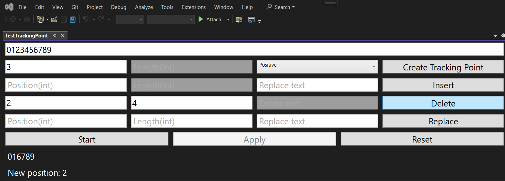
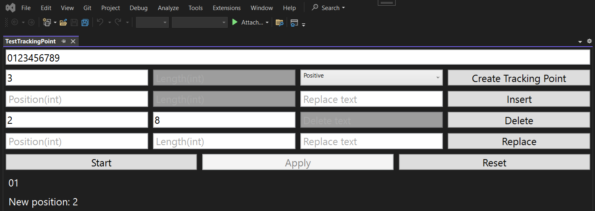
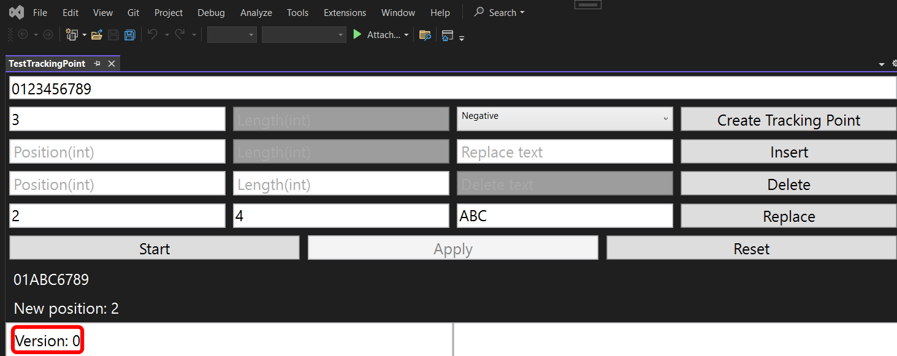
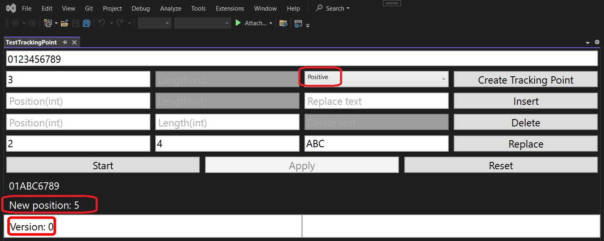

## Objective

1. Introduces
   1. [Tracking](https://learn.microsoft.com/en-us/dotnet/api/microsoft.visualstudio.text.tracking)
   2. [SpanTrackingMode](https://learn.microsoft.com/en-us/dotnet/api/microsoft.visualstudio.text.spantrackingmode)
   3. [PointTrackingMode](https://learn.microsoft.com/en-us/dotnet/api/microsoft.visualstudio.text.pointtrackingmode)
   4. [ITrackingPoint](https://learn.microsoft.com/en-us/dotnet/api/microsoft.visualstudio.text.itrackingpoint)
   5. [ITrackingSpan](https://learn.microsoft.com/en-us/dotnet/api/microsoft.visualstudio.text.itrackingspan)

2. 

## Build and Run

1. Delete. Remove the interval within and the interval to be removed is the "tail" 

2. The left portion of the diagram below is achieved from the above.

3. The right portion of the diagram above is achieved from the below.

4. A little more interesting is the situation with insertion (when the insertion location is the tracked position) and replacement (when the fragment to be replaced covers the tracked position) – here we can control where the tracked position will move: to the beginning or end of the fragment to be inserted. This behavior is affected by the PointTrackingMode parameter, which has 2 values: Negative (put the pointer on the first inserted character) and Positive (put on the last inserted character): 

5. Diagram

Here we go...

## Reference.

1. https://mihailromanov.wordpress.com/2021/11/05/json-on-steroids-2-2-visual-studio-editor-itextbuffer-and-related-types

