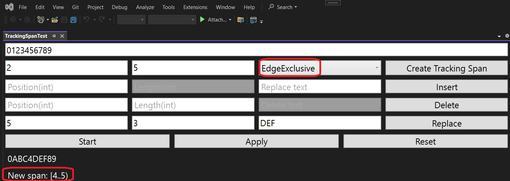
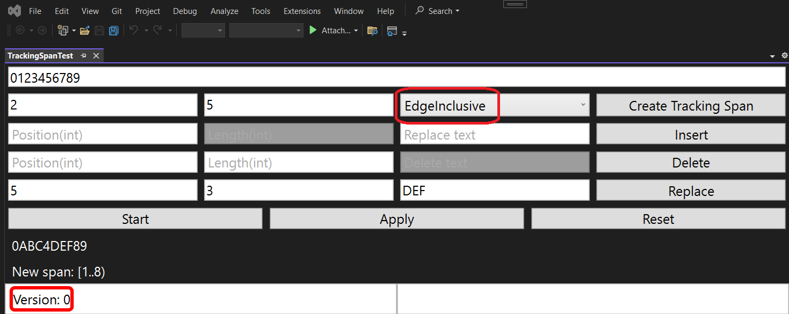
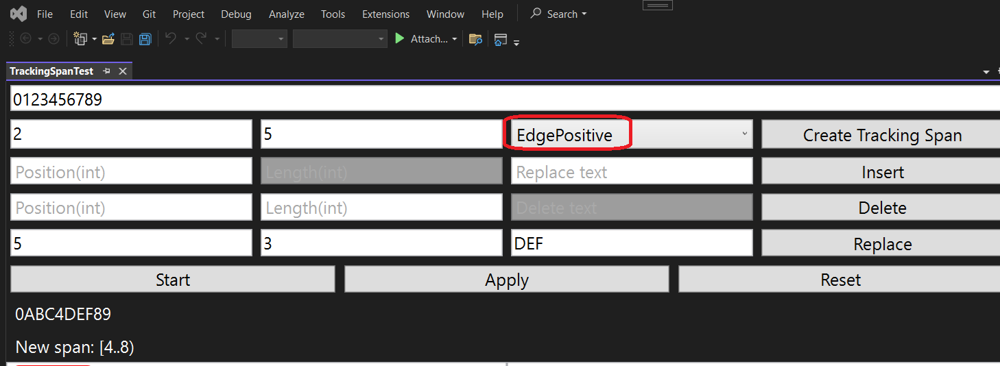
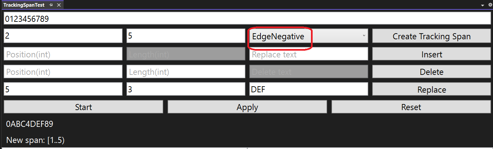

## Objective

1. Introduces
   1. [Tracking](https://learn.microsoft.com/en-us/dotnet/api/microsoft.visualstudio.text.tracking)
   2. [SpanTrackingMode](https://learn.microsoft.com/en-us/dotnet/api/microsoft.visualstudio.text.spantrackingmode)
   3. [PointTrackingMode](https://learn.microsoft.com/en-us/dotnet/api/microsoft.visualstudio.text.pointtrackingmode)
   4. [ITrackingPoint](https://learn.microsoft.com/en-us/dotnet/api/microsoft.visualstudio.text.itrackingpoint)
   5. [ITrackingSpan](https://learn.microsoft.com/en-us/dotnet/api/microsoft.visualstudio.text.itrackingspan)

2. 

EdgeExclusive - only characters from the old interval should be included in the final interval and not newly inserted characters. To do this, the initial position of the interval works in the Positive mode, and the end position works in the Negative mode

EdgeInclusive is the opposite of EdgeExclusive, i.e. all intersecting intervals are included in the original one. Therefore, boundaries are tracked in opposite modes: the beginning in Negative and the end in Positive

EdgePositive – Both Borders in Pisitive Mode

EdgeNegative – Both boundaries in Negative mode

## Build and Run

## Reference.

1. https://mihailromanov.wordpress.com/2021/11/05/json-on-steroids-2-2-visual-studio-editor-itextbuffer-and-related-types

