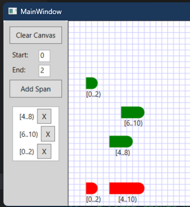

## Objective

1. Introduces `Span` and `NormalizedSpanCollection` 

2. For the full article, [click here](..\221500-TextBufferIntro\1-ITextBuffer.md)

3. This example, is a wpf example and not an extension.

## Build and Run
1. Well, go ahead.

1. 

## Reference.
1. https://mihailromanov.wordpress.com/2021/11/05/json-on-steroids-2-2-visual-studio-editor-itextbuffer-and-related-types

