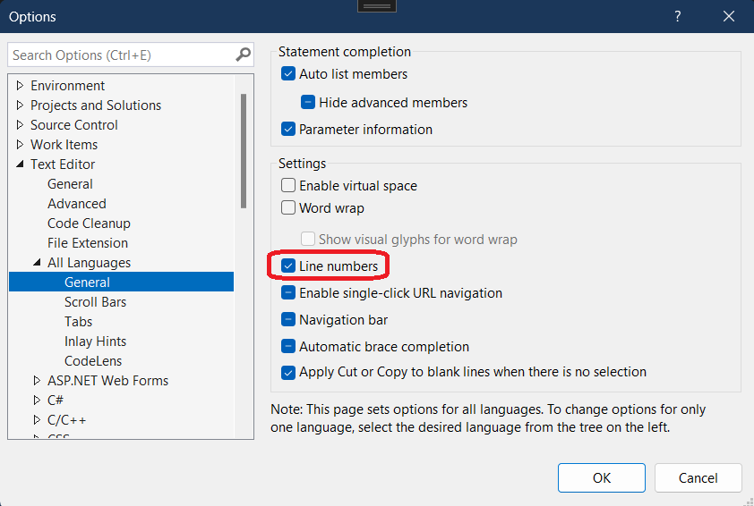
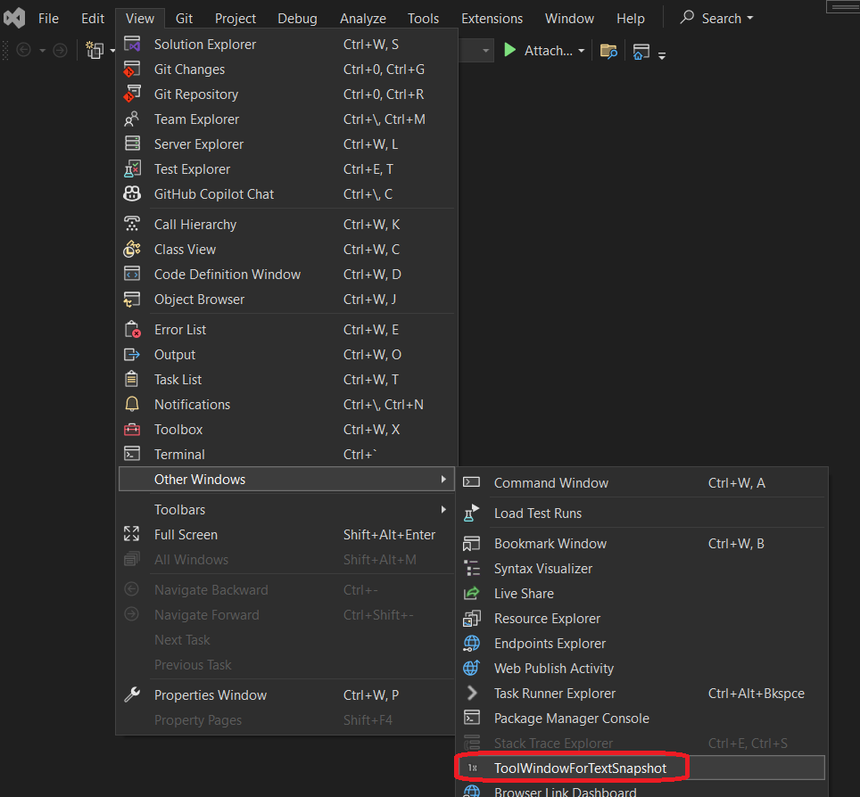
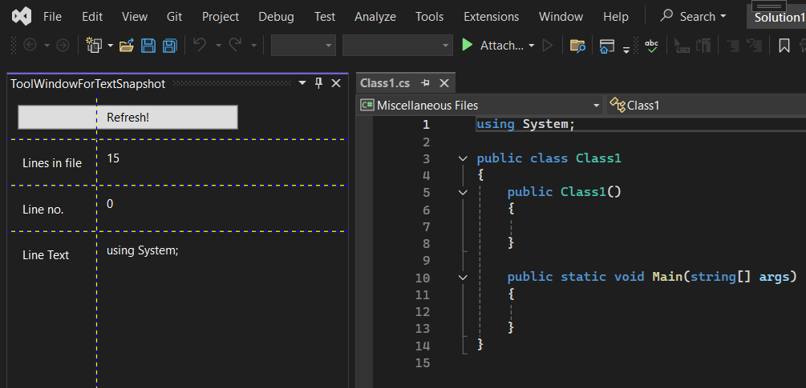
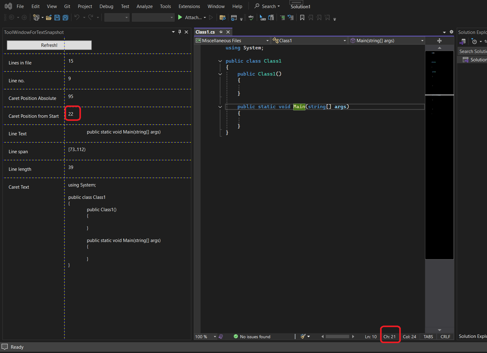

## Objective

1. Introduces `ITextSnapshot` 

2. For the full article, [click here](..\220560-TextBufferIntro\1-ITextBuffer.md)

4. 

## Build and Run
1. Reset Visual Studio Exp instance and then Launch it.

2. Ensure the line numbers are enabled for text files as follows.
   1. Tools -> Options -> Text Editor -> All Languages -> General

   

3. Now open the tool window. View -> Other Windows -> ToolWindowForTextSnapShot



4. Open a file say Class1.cs, then click Refresh button on the tool window. Observe line no fields etc.



5. Next click any where in side the text file say on the line `public Class()`. Then click the Refresh button again and observe. 




## Notes

1. From `wpfTextView`, we get the `textBuffer`, and then from it, we can get the `textSanpshot`. The textSnapshot is a collection of lines(`ITextSnapshotLine`). The `ITextSnapshotLine` has the line number as a property.

```cs
IWpfTextView wpfTextView = GetCurentWpfTextView();

ITextBuffer textBuffer = wpfTextView.TextBuffer;

ITextSnapshot textSnapshot = textBuffer.CurrentSnapshot;

List<ITextSnapshotLine> lines = textSnapshot.Lines.ToList();
```

2. If you want to get the details of a line where the caret is currently present, you can get it as follows.

```cs
ITextCaret caret = wpfTextView.Caret;

CaretPosition caretPosition = caret.Position;

List<IWpfTextViewLine> wpfTextViewLines = wpfTextView.TextViewLines.WpfTextViewLines.ToList();

SnapshotPoint caretPositionSnapshotPoint = caretPosition.BufferPosition;

ITextSnapshotLine caretLine = caretPositionSnapshotPoint.GetContainingLine();
```

3. And from the caretLine we can get the `SnapshotPoint` representing the current exact position of the caret and also the `SnapshotSpan` representing the entire line. 

```cs
SnapshotPoint caretPositionSnapshotPoint = caretPosition.BufferPosition;

SnapshotPoint startOfCaretLine = caretLine.Start;

SnapshotSpan extentOfLineOfCaret = caretLine.Extent;

SnapshotPoint endOfCaretLine = caretLine.End;
```


## Reference.
1. https://mihailromanov.wordpress.com/2021/11/05/json-on-steroids-2-2-visual-studio-editor-itextbuffer-and-related-types


