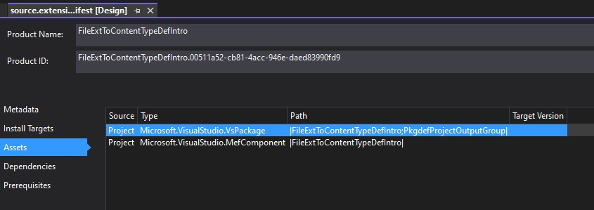
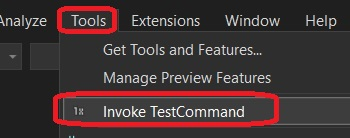
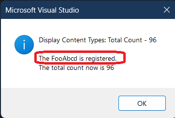

## How this project is created.
1. Just a regualar VSix project, and then added MEF component. 



2. Then added the class FooAbcdContentDefinition

3. Finally add a test command. 


## Build and Run.
1. Build and Run. Run the test command. Tools -> Test command



2. Try the command as follows.



3. Without the MEF Component, the test command will show that Content type is not registered. 

## Notes
1. The Content type is registered with the Content Type registry.
2. Try by commenting out the Content type(the following lines). You will see that the content type is not registered and the above test fails.

```cs
[Export]
[Name(ContentTypeName)]
[BaseDefinition(CodeRemoteContentDefinition.CodeRemoteContentTypeName)]
internal static ContentTypeDefinition FooContentTypeDefinition;

[Export]
[FileExtension(".FooAbcd")]
[ContentType(ContentTypeName)]
internal static FileExtensionToContentTypeDefinition FooFileExtensionDefinition;
```

3. So in summary, to register a command type, make this a MEF component. 

4. Another important thing to understand here is, `IFileExtensionRegistryService` works correctly here. In an earlier example(IFileExtRegSerNotWorking), the `IFileExtensionRegistryService` does not return the extensions for `cs` and `txt` file extensions. This is reported in [stackoverflow](https://stackoverflow.com/q/79194608) and [microsoft questions](https://learn.microsoft.com/en-us/answers/questions/2120142/)

5. 

## References
1. https://github.com/microsoft/VSSDK-Extensibility-Samples/tree/master/AsyncQuickInfo
2. https://learn.microsoft.com/en-us/visualstudio/extensibility/managed-extensibility-framework-in-the-editor
3. https://github.com/Microsoft/vs-editor-api/wiki/Modern-Quick-Info-API
4. asdf


