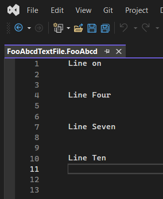

## Objective 

1. Introduces **IFilePathToContentTypeProvider** 
2. 

## Build and Run.
1. Reset Vs Exp instance, Rebuild, and lauch the app.

2. Ensure a break point is set in the following method

```cs
public bool TryGetContentTypeForFilePath(string filePath,
          out IContentType contentType)
{

}
```

2. Open a file with the extension .fooabcd.


3. Ensure the break point is hit. The press F5 to continue.

4. Launch the app, Tools -> Invoke TestCommand. I get the following exception.


```text
Microsoft.VisualStudio.Composition.CompositionFailedException
  HResult=0x80131500
  Message=Expected 1 export(s) with contract name "Microsoft.VisualStudio.Utilities.IFilePathToContentTypeProvider" but found 5 after applying applicable constraints.
  Source=Microsoft.VisualStudio.Composition
  StackTrace:
   at Microsoft.VisualStudio.Composition.ExportProvider.GetExports(ImportDefinition importDefinition)
   at Microsoft.VisualStudio.Composition.ExportProvider.GetExports[T,TMetadataView](String contractName, ImportCardinality cardinality)
   at Microsoft.VisualStudio.Composition.ExportProvider.GetExport[T,TMetadataView](String contractName)
   at Microsoft.VisualStudio.Composition.ExportProvider.GetExportedValue[T]()
   at Microsoft.VisualStudio.ComponentModelHost.ComponentModel.GetService[T]()
   at FilePathToContentTypeProviderIntro.TestCommand.Execute(Object sender, EventArgs e) in C:\Trials\Ex\LearnVsExt\src\apps\232200-FilePathToContentTypeProviderIntro\TestCommand.cs:line 110
   at System.ComponentModel.Design.MenuCommand.Invoke()
   at Microsoft.VisualStudio.Shell.OleMenuCommandService.Microsoft.VisualStudio.OLE.Interop.IOleCommandTarget.Exec(Guid& commandGroup, UInt32 nCmdId, UInt32 nCmdExcept, IntPtr pIn, IntPtr vOut)
```

5. TODO: Need to understand more. Whay am I getting that exception? 

## Notes.
1. In this example, we dont need the following field of type `FileExtensionToContentTypeDefinition` in the `CustomContentTypeDefinition` class. This field is used to connect or associate a Content type with a file extension. But for this example, this association is done in the `IFilePathToContentTypeProvider` implimentation(see below). So the following field is commented out in the class.

```cs
//[Export]
//[ContentType(CustomContentTypeConstants.ContentTypeName)]
//[FileExtension(CustomContentTypeConstants.FileExtension)]
//internal static FileExtensionToContentTypeDefinition FooAbcdFileExtensionDefinition { get; set; }
```

1. Note that the `IFilePathToContentTypeProvider` implimentation(`CustomFileExtensionToContentTypeProvider`) is decorated with a file extension attribute. `CustomContentTypeConstants.FileExtension` represents a file extension, for this example the value is `.fooabcd`.

```cs
[FileExtension(CustomContentTypeConstants.FileExtension)]
internal class CustomFileExtensionToContentTypeProvider : IFilePathToContentTypeProvider
{
    [Import]
    IContentTypeRegistryService ContentTypeRegistryService { get; set; }

    public bool TryGetContentTypeForFilePath(string filePath, out IContentType contentType)
    {
        // Just assign the content type and then return true.
        // So all that we are doing in here is, for a given extension(in this case its .csabcd
        // just assign the CSharp content type.
        contentType = ContentTypeRegistryService.GetContentType(CustomContentTypeConstants.ContentTypeName);
        return true;
    }
}
```

3. Now whenever a file with an extension `.fooabcd` is opened, the visual studio api calls the above `TryGetContentTypeForFilePath` method.    

2. For a full overview refer to [this article](Articles/2-VsEditor-ContentTypes.md)

3. Open a file with the extension .fooabcd.


4. Ensure the break point is hit. The press F5 to continue.

5. So we see that the method `TryGetContentTypeForFilePath` is called, when a file with extension `.fooabcd` is opened. 

6. Now open any other kind of file, say Class1.cs. Now observe that the above method is NOT called by the api. 

7. 