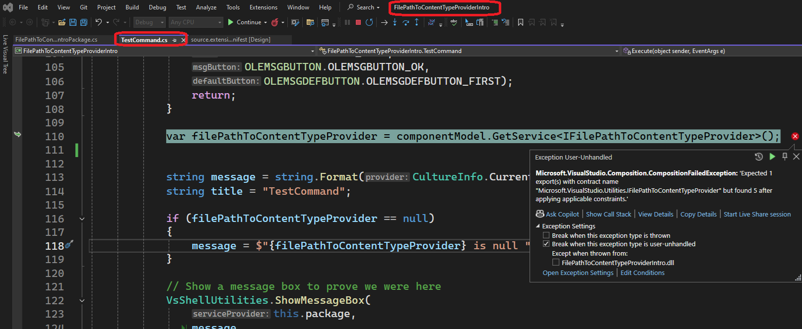

## Objective 

1. Introduces **IFilePathToContentTypeProvider** 
2. Launch the app, Tools -> Invoke TestCommand. I get the following exception.



```text
Microsoft.VisualStudio.Composition.CompositionFailedException
  HResult=0x80131500
  Message=Expected 1 export(s) with contract name "Microsoft.VisualStudio.Utilities.IFilePathToContentTypeProvider" but found 5 after applying applicable constraints.
  Source=Microsoft.VisualStudio.Composition
  StackTrace:
   at Microsoft.VisualStudio.Composition.ExportProvider.GetExports(ImportDefinition importDefinition)
   at Microsoft.VisualStudio.Composition.ExportProvider.GetExports[T,TMetadataView](String contractName, ImportCardinality cardinality)
   at Microsoft.VisualStudio.Composition.ExportProvider.GetExport[T,TMetadataView](String contractName)
   at Microsoft.VisualStudio.Composition.ExportProvider.GetExportedValue[T]()
   at Microsoft.VisualStudio.ComponentModelHost.ComponentModel.GetService[T]()
   at FilePathToContentTypeProviderIntro.TestCommand.Execute(Object sender, EventArgs e) in C:\Trials\Ex\LearnVsExt\src\apps\232200-FilePathToContentTypeProviderIntro\TestCommand.cs:line 110
   at System.ComponentModel.Design.MenuCommand.Invoke()
   at Microsoft.VisualStudio.Shell.OleMenuCommandService.Microsoft.VisualStudio.OLE.Interop.IOleCommandTarget.Exec(Guid& commandGroup, UInt32 nCmdId, UInt32 nCmdExcept, IntPtr pIn, IntPtr vOut)
```

3. TODO: Need to understand more. Whay am I getting that exception? 


## Notes
1. This is not working. 


