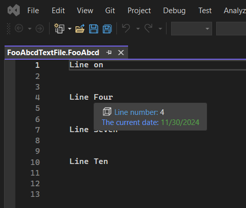
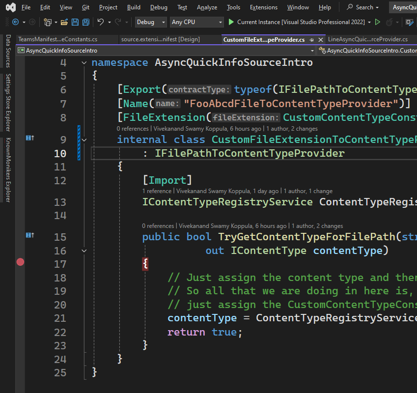

## Objective 

1. Introduces `IAsyncQuickInfoSource` and `IAsyncQuickInfoSourceProvider`

## How this project is created.
1. Start with regular VSix, projet 
2. Make this an MEF component.
3. Then add the rest of the classes such as LineAsyncQuickInfoSource, LineAsyncQuickInfoSourceProvider, CustomContentTypeDefinition, CustomContentTypeConstants and CustomFileExtensionToContentTypeProvider.
4. There are no commands or tool windows in this example. 

## Build and Run
1. Reset Vs Exp instance, Rebuild, and lauch the app.

2. Open a file with extension `fooabcd`. Then hover over some text to observe the quick info



3. Place a break point in the method `GetQuickInfoItemAsync` inside the class `LineAsyncQuickInfoSource`. Observe when the break point is hit. The break point is hit when you hover over some line in a file with extension `.fooabcd`. Try with a different file with extension such as Class1.cs. Observe that the break point is NOT hit. This is because the class `LineAsyncQuickInfoSourceProvider` is decorated with content type attribute. 

```cs
[ContentType(CustomContentTypeConstants.ContentTypeName)]
internal sealed class LineAsyncQuickInfoSourceProvider : IAsyncQuickInfoSourceProvider {}
```

4. So this `LineAsyncQuickInfoSource` is applicable to only those files whose contnet type is specified as attribute above.

5. And as we have seen the example before, the file extension(in this case its `.fooabcd`) is associated with a file of extension as follows.

```cs
[FileExtension(CustomContentTypeConstants.FileExtension)]
internal class CustomFileExtensionToContentTypeProvider : IFilePathToContentTypeProvider {}
```

6. Place the break point as follows.



7.  Now open a text file. Each time a text file is opened and the mouse is howered over the text, the break point is hit.

8.  Say two files are opened, and mouse is hovered over each one of the two files. Then the break point is hit for both the cases. Next when you switch between the two files using Alt + Tab, the break point is NOT hit. So after a file is opened, the break point is hit only once per file. If the file is closed and reopened, then the break point is hit again. 


