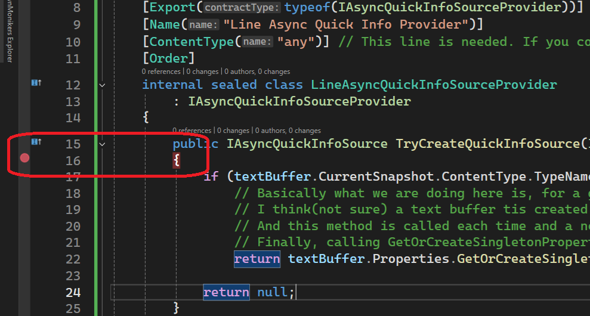

## Objective 

1. In the previous example(AsyncQuickInfoSourceIntro), `IAsyncQuickInfoSourceProvider` is introduced.
2. This almost same, and hence it demos the same.
3. The difference is in the `LineAsyncQuickInfoSourceProvider` class. The difference is two fold.
4. First, the ContentType Attribute. Earlier the class look like this.
```cs
[Export(typeof(IAsyncQuickInfoSourceProvider))]
[Name("Line Async Quick Info Provider")]
[ContentType(CustomContentTypeConstants.ContentTypeName)]
[Order]
internal sealed class LineAsyncQuickInfoSourceProvider : IAsyncQuickInfoSourceProvider
{
    public IAsyncQuickInfoSource TryCreateQuickInfoSource(ITextBuffer textBuffer)
    {
        // This ensures only one instance per textbuffer is created
        return textBuffer.Properties.GetOrCreateSingletonProperty(() => new LineAsyncQuickInfoSource(textBuffer));
    }
}
```
5. Now the class looks like the following.

```cs
[Export(typeof(IAsyncQuickInfoSourceProvider))]
[Name("Line Async Quick Info Provider")]
[ContentType("any")] // This line is needed. If you completely remove this attribute, the following method is not called at all.
[Order]
internal sealed class LineAsyncQuickInfoSourceProvider 
    : IAsyncQuickInfoSourceProvider
{
    public IAsyncQuickInfoSource TryCreateQuickInfoSource(ITextBuffer textBuffer)
    {
        if (textBuffer.CurrentSnapshot.ContentType.TypeName == CustomContentTypeConstants.ContentTypeName)
            // Basically what we are doing here is, for a given textBuffer(which has a given content type) a LineAsyncQuickInfoSource object is assigned.
            // I think(not sure) a text buffer tis created every time a new file is opened in Visual Studio.
            // And this method is called each time and a new text file is opened, and the cursor is hovered over on any of its text.
            // Finally, calling GetOrCreateSingletonProperty, ensures only one instance per textbuffer is created
            return textBuffer.Properties.GetOrCreateSingletonProperty(() => new LineAsyncQuickInfoSource(textBuffer));

        return null;
    }
}
```

6. First there is ContentType attribute. Earlier the content type is `CustomContentTypeConstants.ContentTypeName`. Now its `any`. Note that this `[ContentType("any")]` is necessary. If you comment it out and remove it completely, then the method `TryCreateQuickInfoSource` is not called at all.

7. Next earlier, it simply returns 

```cs
return textBuffer.Properties.GetOrCreateSingletonProperty(() => new LineAsyncQuickInfoSource(textBuffer));
```

8. Now, it has a condition based on content type of the snapshot of the text buffer.

```cs
public IAsyncQuickInfoSource TryCreateQuickInfoSource(ITextBuffer textBuffer)
{
    if (textBuffer.CurrentSnapshot.ContentType.TypeName == CustomContentTypeConstants.ContentTypeName)
        return textBuffer.Properties.GetOrCreateSingletonProperty(() => new LineAsyncQuickInfoSource(textBuffer));

    return null;
}
```

9. Also place the break point as follows.



10. Now open a text file. Each time a text file is opened and the mouse is howered over the text, the break point is hit.

11. Say two files are opened, and mouse is hovered over each one of the two files. Then the break point is hit for both the cases. Next when you switch between the two files using Alt + Tab, the break point is NOT hit. So after a file is opened, the break point is hit only once per file. If the file is closed and reopened, then the break point is hit again. 

12. 


