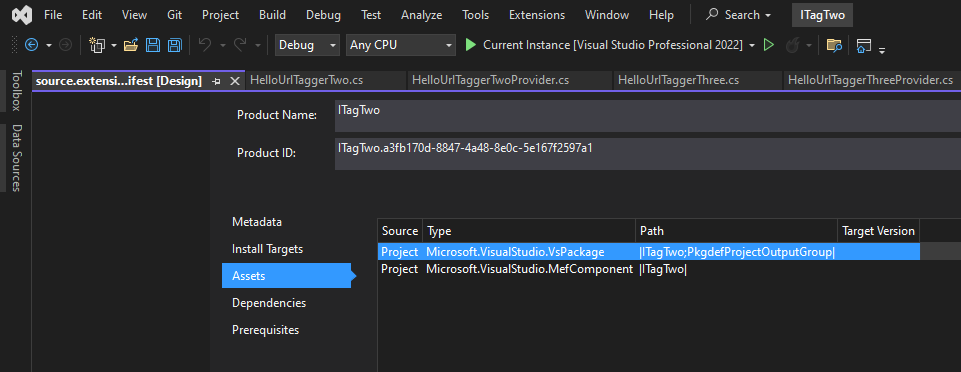
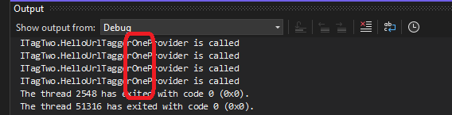
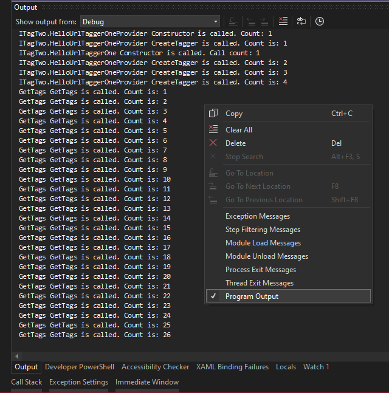
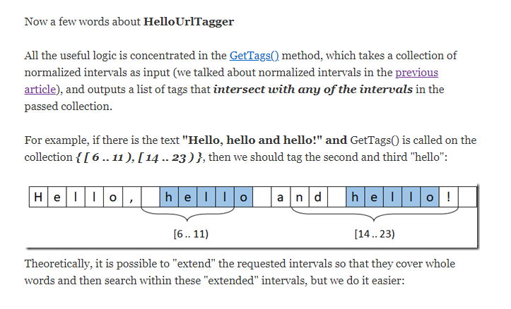

## Objective 

1. This example is similar to ITagOne. This example has `ITaggerProvider` also. Introduces `ITaggerProvider`

2. 

## How the project is created. 

1. Make this into a MEF component.



  

## Build and Run

1. Reset the Visual Studio


2. Lauch the exp insance. Open `HelloTagOne.TagOne` file. Ensure the `HelloUrlTaggerOneProvider.cs` is invoked.



3. Try with `HelloTagTwo.TagTwo` and `HelloTagThree.TagThree` as well.

4. Take a look the output window for messages. View -> Output. Also to supress noise messages, right click and uncheck message types as shown. Try with TaggerTwo as well.



5. In the CreateTagger method look at how the Tagger object is created for `HelloUrlTaggerOneProvider`

```cs
public ITagger<T> CreateTagger<T>(ITextBuffer buffer) where T : ITag
{
return buffer.Properties.GetOrCreateSingletonProperty(() => new HelloUrlTaggerOne(TextSearchService)) as ITagger<T>;
}
```

6. And for HelloUrlTaggerTwoProvider

```cs
public ITagger<T> CreateTagger<T>(ITextBuffer buffer) where T : ITag
{
return (ITagger<T>)new HelloUrlTaggerTwo(TextSearchService);
}
```

7. Note the difference. The first one uses GetOrCreateSingletonProperty. See this [SO Answer](https://stackoverflow.com/a/79324688) 


## Todo

1. Need to understand the GetTags method in all the tagger classes. Its explained here.



2. https://mihailromanov.wordpress.com/2022/06/19/json-on-steroids-2-3-visual-studio-editor-tags-classifiers-and-text-formating-part-1/

3. 

## Refernces:
1. https://stackoverflow.com/a/14720692
2. https://stackoverflow.com/a/28566830
3. https://stackoverflow.com/a/79324688
