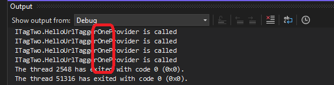

## Objective 

1. This example is similar to ITagOne. This example has ITaggerProvider also.
2. 

## How the project is created. 

1. Make this into a MEF component.

  

## Build and Run

1. Reset the Visual Studio

2. Lauch the exp insance. Open `HelloTagOne.TagOne` file. Ensure the `HelloUrlTaggerOneProvider.cs` is invoked.

3. Try with `HelloTagTwo.TagTwo` and `HelloTagThree.TagThree` as well.

1. 

2. 