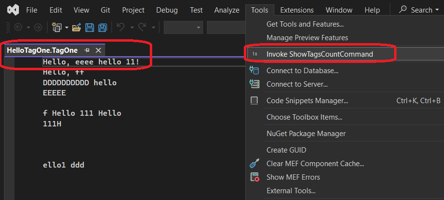
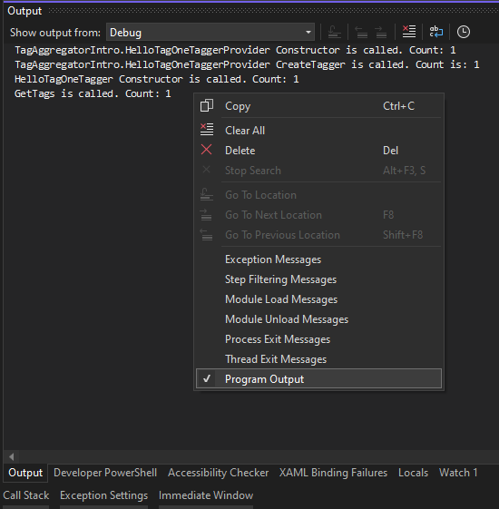

## Objective 

1. This introduces `IBufferTagAggregatorFactoryService` and `ITagAggregator<T>`

2. Earlier examples introduced `ITag`, `ITagger`, and `ITaggerProvider`.

3. 

## How the project is created. 

1. Start with a regular VSix project. 

2. You need to make this an MEF component. Without this, you will get not get correct results.

3. Also add `Tag`, `Tagger`, `TaggerProvider`, and `ContentTypeDefsAndExtAssociations`

4. Add a command item.

5. 

## Build and Run

1. Reset the Visual Studio


2. Ensure HelloTagOne.TagOne file from TagFiles folder is opened. Then invoke the command as shown below.



3. View -> Output(Ctrl + W, O) and study the output as follows. First ensure the noice messages are disabled. 

. 


## Notes.
1. This example demos ITagAggrigator. 

2. This shows that when you call GetTags method on the tag aggrigator, the provider is called to get an instance of the Tagger, and then GetTags is called on that tagger object.

. 

3. Instead of the creating the Tagger directly, we are using the following approach. This is discussed in an earlier example.

```cs

return buffer.Properties.GetOrCreateSingletonProperty(
    () => new HelloTagOneTagger()) as ITagger<T>;

```

   


## Todo
1. Need to fully understand IMappingTagSpan that is returned when you call GetTags method, either from the aggrigator or from the Tagger object.

2. Need to undestand What MEF component is. 

## Refernces:
1. https://stackoverflow.com/a/14720692
2. https://stackoverflow.com/a/28566830
3. https://stackoverflow.com/a/79324688
4. https://learn.microsoft.com/en-us/dotnet/api/microsoft.visualstudio.text.tagging.ibuffertagaggregatorfactoryservice
5. https://learn.microsoft.com/en-us/dotnet/api/microsoft.visualstudio.text.tagging.itagaggregator-1
6. 


