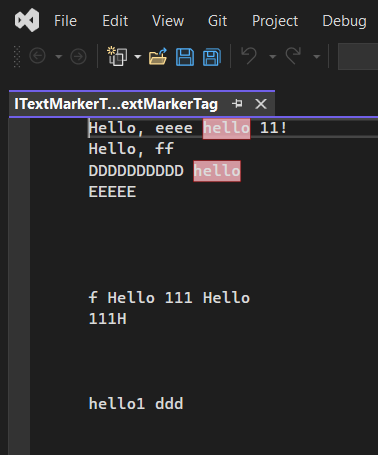
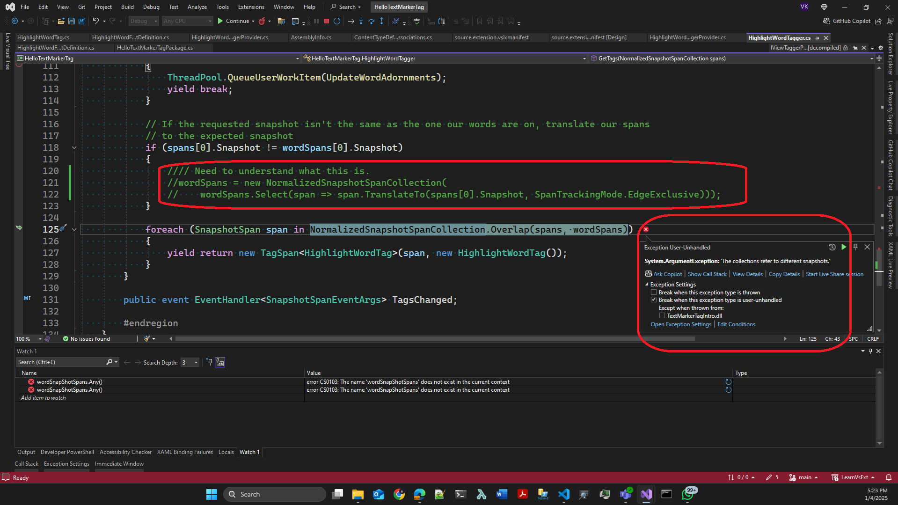

# Trails With ToolBox

## Objective
1. To understand TextMarkerTag. This also uses MarkerFormatDefinition

## How this project is built.

1. Start with regular VSix project.

2. Add an Editor Classifier project item. For more information, see Create an extension with an editor item template.

3. Delete the existing class files. [Take a look at this](https://learn.microsoft.com/en-us/visualstudio/extensibility/walkthrough-customizing-the-text-view#create-a-mef-project).
4. Then add the classes as in the example.

## Build and Run.

1. Reset Vs Exp instance. 
2. Launch the app. Open `TagFiles\ITextMarkerTag.ITextMarkerTag` file inside of TagFiles folder. 
3. You should see Hello is automatically highlited. 



4. Look for the line `findData.FindOptions = FindOptions.WholeWord | FindOptions.MatchCase;`. Try commmenting out that line and re run. Every hello irrespective of capital or small will be highlited.

```cs
FindData findData = new FindData(wordToLookFor, SourceBuffer.CurrentSnapshot);
findData.FindOptions = FindOptions.WholeWord | FindOptions.MatchCase;
IEnumerable<SnapshotSpan> wordSnapShotSpans = TextSearchService2.FindAll(findData);
```

5. Next 


## Notes.

1. In the TagVarietie sample, `TextMarkerTag` is introduced. In this example, this is expanded.

2. In this example, provider derives from `IViewTaggerProvider` instead of `ITaggerProvider`. 

3. The `IViewTaggerProvider` creates a ITagger providing `ITextView`.

```cs
public ITagger<T> CreateTagger<T>(ITextView textView, ITextBuffer buffer) where T : ITag
{
    return new HighlightWordTagger(textView, buffer, TextSearchService) as ITagger<T>;
}
```

4. Inside of tagger, `ITextView` is needed because, we need to handle `View.LayoutChanged` event.

```cs
View.LayoutChanged += ViewLayoutChanged;
```

5. This is needed if you want dynamically highlite hello word as you type.

6. Do the following. 
7. Once the file `\TagFiles\ITextMarkerTag.ITextMarkerTag` is opned, try typing hello in some new or blank line. The new hello will also be highlited.

8. Commit out the event subscription line 

```cs
// View.LayoutChanged += ViewLayoutChanged;
```

9. Reset, build and run the app. Once the file is opened, hello will be highlited. Now type hello, in a new line. This time newly typed `hello` will not be highlited. This is because the layout changed is not handled. 

10. Note that `ThreadPool.QueueUserWorkItem(UpdateWordAdornments);`. This means `UpdateWordAdornments` method is run in a different thread.

11. Finally in the GetTags method of the Tagger class, find the following. 

```cs
if (spans[0].Snapshot != wordSpans[0].Snapshot)
{
    // Need to understand what this is.
    wordSpans = new NormalizedSnapshotSpanCollection(
        wordSpans.Select(span => span.TranslateTo(spans[0].Snapshot, SpanTrackingMode.EdgeExclusive)));
}
```

12. If I comment out, the above line, then I get exception when I edit the `\TagFiles\ITextMarkerTag.ITextMarkerTag` file. 




## References

1. https://learn.microsoft.com/en-us/dotnet/api/microsoft.visualstudio.text.tagging.iviewtaggerprovider

2. https://learn.microsoft.com/en-us/dotnet/api/microsoft.visualstudio.text.tagging.itaggerprovider

3. Here 

4. asdfasdf

5. asdf


## Todo
1. https://github.com/microsoft/VSSDK-Extensibility-Samples/blob/master/Highlight_Word/C%23/HighlightWordTagger.cs
2. 

