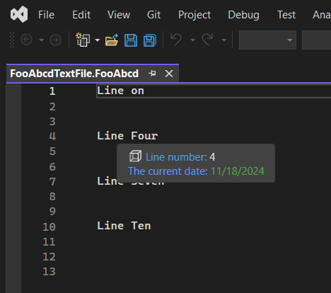
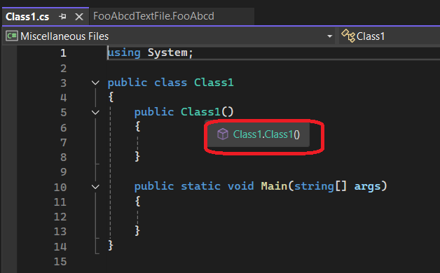

## How this project is created.
1. This extends the earlier example AsyncQuickInfoSourceIntro.
2. This example adds a new custom content type FooAbcd.
3. So the quick info is applicable to only files which of a content type of FooAbcd, that is, files which have an extension of ".FooAbcd"

## Build and Run.
1. Open a file with extension FooAbcd as follows and test it.



2. Open a cs file as now, and try the same as above with the cs file.



3. So if you try with any other file type, say .cs file, this will not work as above image shows. This is simply because the `LineAsyncQuickInfoSourceProvider` is associated with only FooAbcd content type, and not CSharp file type.

```cs
[ContentType("FooAbcd")]
[Order]
internal sealed class LineAsyncQuickInfoSourceProvider : IAsyncQuickInfoSourceProvider {}
```

## Notes
1. The Content type is registered with the Content Type registry.

2. Try by commenting out the Content type(the following lines). You will see that the content type is not registered and the above test fails.

```cs
[Export]
[Name(ContentTypeName)]
[BaseDefinition(CodeRemoteContentDefinition.CodeRemoteContentTypeName)]
internal static ContentTypeDefinition FooContentTypeDefinition;

[Export]
[FileExtension(".FooAbcd")]
[ContentType(ContentTypeName)]
internal static FileExtensionToContentTypeDefinition FooFileExtensionDefinition;
```
3. 

## References
1. https://github.com/microsoft/VSSDK-Extensibility-Samples/tree/master/AsyncQuickInfo
2. https://learn.microsoft.com/en-us/visualstudio/extensibility/managed-extensibility-framework-in-the-editor
3. https://github.com/Microsoft/vs-editor-api/wiki/Modern-Quick-Info-API
4. 