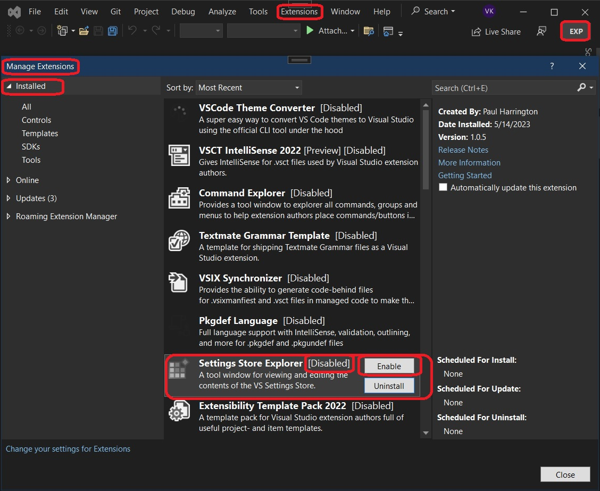
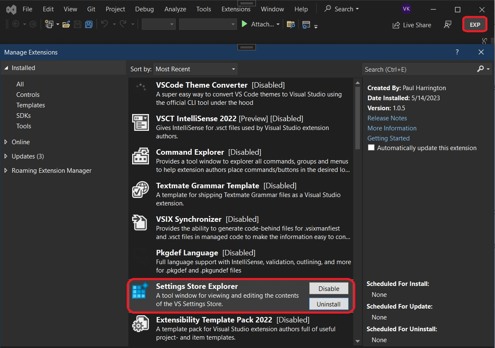
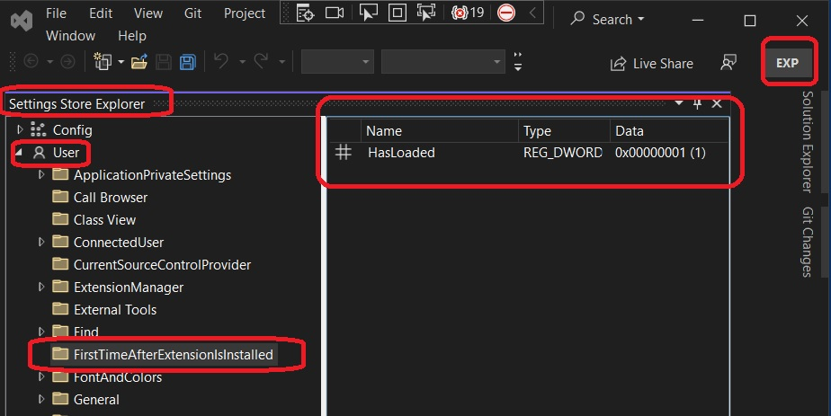

## Rule Based UI Context.

1. This example starts from the earlier example 501125-ProvideAutoLoad. This also uses concepts of writing to store settings in the example 400660-WriteVsStoreConfigSettings 

2. Scenerio: Potencially run some code to alert the user when first time Visual Studio is run after the extension is installed. So a user has installed your extension. And after the installation, the user runs Visual Studio, and now you want visual studio to pop up a message box and say Thanks to the user as has choosen to install the extension and give it a try. And this message box should pop up only this time and not bother the user again later ever. So the next time the Visual Studio is started again, that message box should not pop up again.

3. Visual Studio Setting store is where Visual Studio, during and after installation, stores many of its settings. There is an excellent tool to visualize this. This tool comes in the form of [an extension and can be installed from here](https://marketplace.visualstudio.com/items?itemName=PaulHarrington.SettingsStoreExplorerPreview). For this exercise, **do install this extension**. This is a requirement.

4. Also, as you starts to run or debug(F5 or Ctrl + F5), EXP instance of Visual Studio fires up, and in it, the Settings Store Explore is present but disabled. You need to enable it. See the steps in 400660-WriteVsStoreConfigSettings

5. Reference: 
   1. https://www.youtube.com/watch?v=p328QcgZObs&t=760s
   2. https://learn.microsoft.com/en-us/visualstudio/extensibility/how-to-use-rule-based-ui-context-for-visual-studio-extensions
   3. 


6. We will be using this: **UserSettingsStoreQuery:<query>**

7. Create a VSix project and add a command to it.
   
8. Next add autoload guid and string as follows.
   1. In the FirstTimeAfterExtensionIsInstalledPackage.vsct file look for **Symbols** xml tag and add **GuidSymbol** as follows. The guid shuld be newly genrated one. Do not copy paste from somewhere else.
      ```xml
      <Symbols>
         <GuidSymbol name="autoload" value="{6c650c5a-d7d6-407b-993f-426d53ddbdde}" />
      </Symbols> 
      ```
   2. In the FirstTimeAfterExtensionIsInstalledPackage.cs file and class PackageGuids. Use the same guid as as above. 
      ```cs
      public const string autoloadString = "6c650c5a-d7d6-407b-993f-426d53ddbdde";
      public static Guid autoload = new Guid(autoloadString);
      ```

9. Modify the attributes to the **FirstTimeAfterExtensionIsInstalledPackage** class as follows.
      ```cs
      [PackageRegistration(UseManagedResourcesOnly = true, AllowsBackgroundLoading = true)]
      [Guid(PackageGuidString)]
      [ProvideAutoLoad(PackageGuids.autoloadString, PackageAutoLoadFlags.BackgroundLoad)]
      [ProvideMenuResource("Menus.ctmenu", 1)]
      [ProvideUIContextRule(PackageGuids.autoloadString, 
        name: "Auto Load",
        expression: "!HasLoadedTermName",
        termNames: new[] { "HasLoadedTermName" },
        termValues: new[] { "UserSettingsStoreQuery:FirstTimeAfterExtensionIsInstalled\\HasLoaded" })]
      ```

10. We will be using Shell settings manager to write and read the settings of Visual Studio. So add the following code the Initialize method of the pacakge class. So if the property HasLoaded exists, means that the visual studio has run atleast once after the installation of the extension. 
      ```cs
      var settingsManager = new ShellSettingsManager(this);
      var writableUserSettingsStore = settingsManager.GetWritableSettingsStore(SettingsScope.UserSettings);
      var readOnlyUserSettingsStore = settingsManager.GetReadOnlySettingsStore(SettingsScope.UserSettings);

      var hasLoadedPropertyExists = readOnlyUserSettingsStore.PropertyExists(@"FirstTimeAfterExtensionIsInstalled", "HasLoaded");

      if (!hasLoadedPropertyExists)
      {
         writableUserSettingsStore.CreateCollection("FirstTimeAfterExtensionIsInstalled");
         // writableUserSettingsStore.SetInt32("FirstTimeAfterExtensionIsInstalled", "VsRunCount", 1);
         writableUserSettingsStore.SetBoolean("FirstTimeAfterExtensionIsInstalled", "HasLoaded", true);

         var message = string.Format(CultureInfo.CurrentCulture, "Thanks for trying out. Good Day");
         var title = "Thanks!!";

         // Show a message box to prove we were here
         VsShellUtilities.ShowMessageBox(
            this,
            message,
            title,
            OLEMSGICON.OLEMSGICON_INFO,
            OLEMSGBUTTON.OLEMSGBUTTON_OK,
            OLEMSGDEFBUTTON.OLEMSGDEFBUTTON_FIRST);
      }
      ```
11. Place a break point at the start of the above code. Run and debug. Close and restart the EXP instance. Observe when the method is called.
    1.  The method is called when the visual studio is started after the installation. This time, its not when the command is invoked.
    2.  Now restart the EXP instance. Now the mthod is not called. Now invoke the command. Now the method is called.

12. So from the second time on, the package is loaded only as required. Only when the command is invoked. If the command is **NOT** invoked, the package is not loaded at all!!! But after the intallatioin, the package is loaded irrespective of weather the command is invoked or not!!   

13. LOAD the extension as late as you possiblly can. This is important. Loading packages can have a performance impact and loading them sooner than needed is not the best practice. 

14. Visual Studio Setting store is where Visual Studio, during and after installation, stores many of its settings. There is an excellent tool to visualize this. This tool comes in the form of [an extension and can be installed from here](https://marketplace.visualstudio.com/items?itemName=PaulHarrington.SettingsStoreExplorerPreview). For this exercise, **do install this extension**. This is a requirement.


15. Also in the exp instance(not the regular intance of Visual Studio), observe that the Settings Store Explorer is disabled.



18. Enable this extension and close the exp instance. Then start the debugging again. Press F5.

19. Now ensure the extension is enabled.



20. Now open the Setting Store Explorer in the Exp instance. View -> Other Windows -> Settings Store Explorer. Ensure you now have a setting as below.



21. So when you run for the first time, this setting is created. If there is no such setting, then it means Visual Studio is being run for the first time, after the installation of the extension. So based on that, we will show the message. Also we will create this setting. Next time onwords, we will check for this extension and if its there, that means this is not the first time, so we will not show the message.