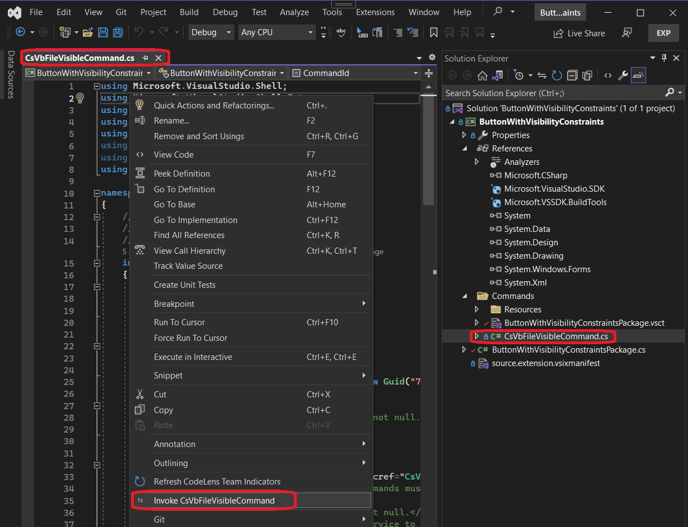
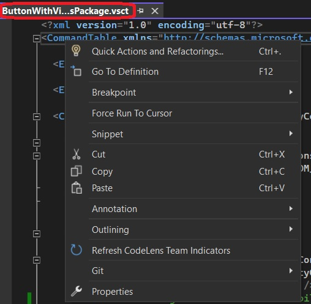

## Demos VisibilityConstraints

1. A button can be made to be Visible or invisible under some conditions. 

2. Scenerio: A button on the context menu should be visible only when the file in the solution explorer is a .cs or .vb file. 

3. Create a new VSIX package. Then add a new folder Commands, and add a new command to it.

4. To the package class, add attributes as follows.

```cs
[ProvideUIContextRule(PackageGuids.uiContextSupportedFilesString,
        name: "Supported Files",
        expression: "CSharp | VisualBasic",
        termNames: new[] { "CSharp", "VisualBasic" },
        termValues: new[] { "HierSingleSelectionName:.cs$", "HierSingleSelectionName:.vb$" })]
    
```

5. In the Visual Studio Command Table file, vsct file, add the following tags

```xml
<CommandFlag>DynamicVisibility</CommandFlag>
```

```xml
<VisibilityConstraints>
   <VisibilityItem guid="guidButtonWithVisibilityConstraintsPackageCmdSet" id="CsVbFileVisibleCommandId" context="uiContextSupportedFiles" />
</VisibilityConstraints>	
```

```xml
<GuidSymbol name="uiContextSupportedFiles" value="{24551deb-f034-43e9-a279-0e541241687e}" />
```

6. Ensure Guids are added to the guids class follows.

```cs
public const string uiContextSupportedFilesString = "24551deb-f034-43e9-a279-0e541241687e"; 
public static Guid uiContextSupportedFiles = new Guid(uiContextSupportedFilesString);
```

7. Build and Run 

8. In the exp instance, open a solution which has .cs file and other types of files. Open the .cs file and other file such as .vsct file. Right click on the file and observe the command. The cs file should have the command .vsct should not have the commmand.
   1. Cs file



   2. Vsct file



1. Finally note the following.


```cs
termValues: new[] { "HierSingleSelectionName:.cs$", "HierSingleSelectionName:.vb$" }
```        

Note you can use the following as well. Here we are using ActiveEditorContentType instead of HierSingleSelectionName
The difference is the following. When you use HierSingleSelectionName, you must open a solution in visual studio and then 
open files from that solution. Only then the Visibility of the command works as expected. So the context is a file belonging to a solution.
On the other hand, with ActiveEditorContentType, you can open file from any arbitraty location as well. 
So use the following and see.

```cs
termValues: new[] { "ActiveEditorContentType:cs", "ActiveEditorContentType:vb" }
```
