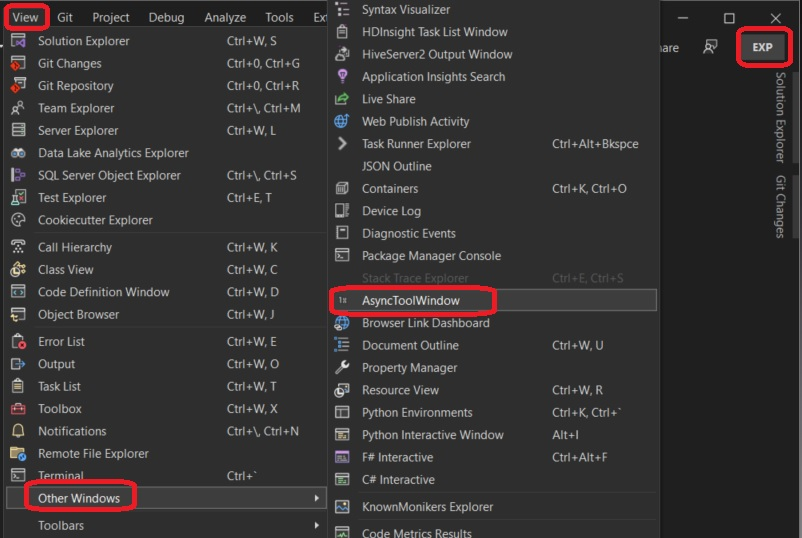
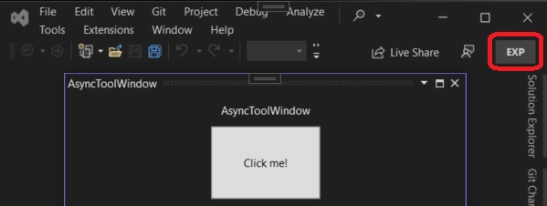
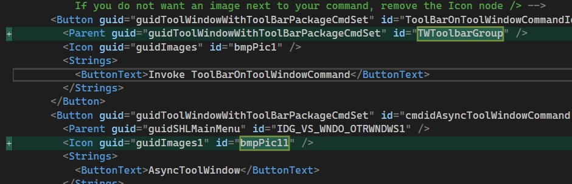
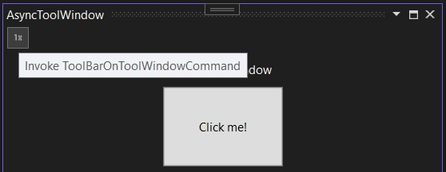

## Simple Tool Window Extension

1. This is based on the following.
   1. https://learn.microsoft.com/en-us/visualstudio/extensibility/adding-a-toolbar-to-a-tool-window

2. Steps to create.
   1. Create a VSix project. Add a commands folder.
   
   2. Add Async Tool Window to the commands folder.
   
   
   
   3. Build and run.
   
   
   
   And the window
   
         
   
   4. In the Visual Studio Command Table file(.vsct), do the following changes
   5. Add IDSymbols as follows.
   ```xml
   <IDSymbol name="TWToolbar" value="0x1000" />
   <IDSymbol name="TWToolbarGroup" value="0x1050" />
   ```
   6. Change ImageGuid with name guidImages1 as follows. Add 1 as suffix to each of the names of the IDSymbols.
   
   ```xml
   <GuidSymbol value="{72e30b87-b7bf-4cfd-abee-341bd88fcbe1}" name="guidImages1">
      <IDSymbol name="bmpPic11" value="1" />
      <IDSymbol name="bmpPic12" value="2" />
      <IDSymbol name="bmpPicSearch1" value="3" />
      <IDSymbol name="bmpPicX1" value="4" />
      <IDSymbol name="bmpPicArrows1" value="5" />
      <IDSymbol name="bmpPicStrikethrough1" value="6" />
   </GuidSymbol>
   ```

   7. Add 1 suffix to the bitmap elemet as follows. as follows. Note bmpPic1 is changed to bmpPic11 and so on.
  
   ```xml
   <Bitmap guid="guidImages1" href="Resources\AsyncToolWindowCommand.png" usedList="bmpPic11, bmpPic12, bmpPicSearch1, bmpPicX1, bmpPicArrows1, bmpPicStrikethrough1" />
   ```

   8. Make similar changes to Icon element as well.
   ```xml
   <Icon guid="guidImages1" id="bmpPic11" />
   ```

   9.  Make changes to Button elements as follows.
            

   10. Add a new group as follows.
   
   ```xml
   <Group guid="guidToolWindowWithToolBarPackageCmdSet" id="TWToolbarGroup" priority="0x0000">
      <Parent guid="guidToolWindowWithToolBarPackageCmdSet" id="TWToolbar" />
   </Group>
   ```
   11. Add Menus element in Commands as follows.

   ```xml
   <Menus>
      <Menu guid="guidToolWindowWithToolBarPackageCmdSet" id="TWToolbar" type="ToolWindowToolbar">
         <CommandFlag>DefaultDocked</CommandFlag>
         <Strings>
            <ButtonText>Test Toolbar</ButtonText>
            <CommandName>Test Toolbar</CommandName>
         </Strings>
      </Menu>
   </Menus>
   ```
   
   12. Ensure PackageGuids and PackageIds class are changed as follows.
   

   13. In the async tool window add as follows.
   ```cs
   this.ToolBar = new CommandID(new Guid(PackageGuids.guidToolWindowWithToolBarPackageCmdSetString), 0x1000);
   ```
   14. asdf
3. Build and Run.

4. The only problem with this is Menu Text does not appear. Observe closely the following image. You see the 1x and not any text. Need to find out!!!
   . 