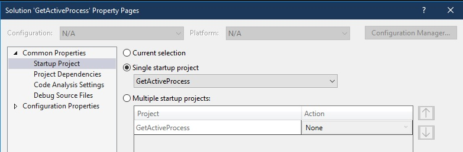
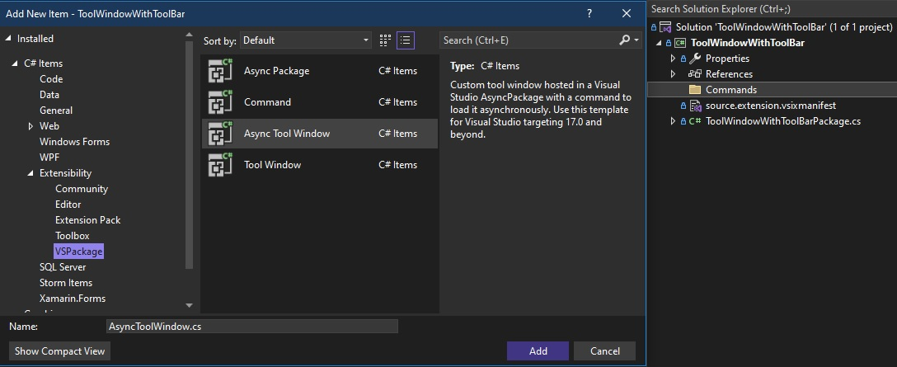
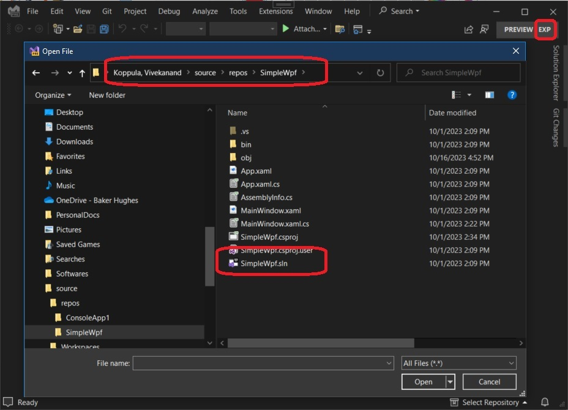
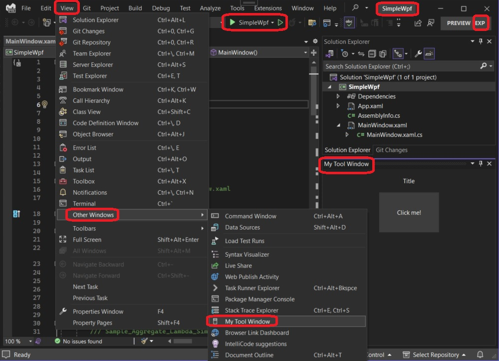
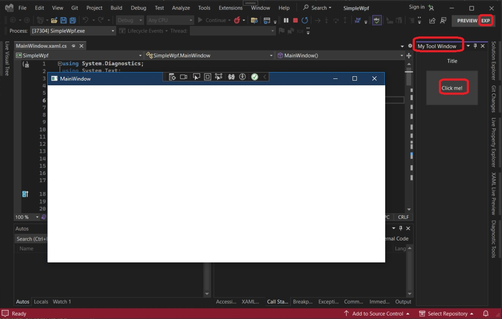

# Gets the active process 

## Objective
1. Visual Studio is for developing application, and during development, we want to load solutions, build and run them. 

2. When we run a solution, they start processes. They can be more than one, when we setup more then one startup projets.



3. We then press F5 to start running the projects. 

4. This example demonistrates how an extension can get more information about such apps which Visual Studio is running and debugging.


## References
1. https://stackoverflow.com/a/36260234/1977871
   1. How to get currently running project from Visual Studio extension

2. https://learn.microsoft.com/en-us/dotnet/api/envdte.debugger

3. https://learn.microsoft.com/en-us/dotnet/api/envdte100.debugger5


## How this project is created.

1. Steps to create.
   1. Create a VSix project. Add a commands folder.
   
   2. Add Async Tool Window to the commands folder.
   
   
   
2. Add an attribute as follows.
```cs
[ProvideToolWindow(typeof(Commands.AsyncToolWindow), Orientation = ToolWindowOrientation.Left, Style = VsDockStyle.Tabbed, 
Window = EnvDTE.Constants.vsWindowKindServerExplorer)]
public sealed class ActiveProcessWithToolWindowPackage : AsyncPackage
{ }
```
The Window is set to **EnvDTE.Constants.vsWindowKindServerExplorer**, you dock the window to left. You can set to **EnvDTE.Constants.vsWindowKindOutput** to dock it down. Or **EnvDTE.Constants.vsWindowKindSolutionExplorer** when you want to dock right.

3. Added the method, GetCurrentModeAndRunningProcess.

## How to run
1. Build and Press F5, and exp instance will start. 
2. Then open a wpf solution.



3. Open the tool window



4. Then run the solution, and then click the button. 



## Notes
1. You can get the current mode. CurrentMode, 
   1. dbgDebugMode.dbgDesignMode, Design Mode
   2. dbgDebugMode.dbgBreakMode, Break Mode
   3. dbgDebugMode.dbgRunMode, Run Mode

2. First we get the DTE object 

```cs
var dte = ServiceProvider.GlobalProvider.GetService(typeof(DTE));            
var dte2 = dte as DTE2;
```

3. Then from DTE, we get the process object. Take a look at the method GetCurrentModeAndRunningProcess

4. 


