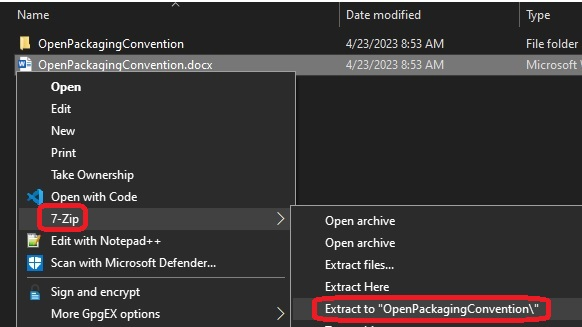
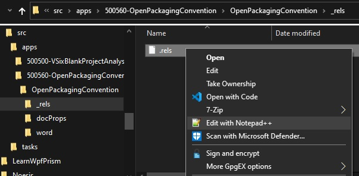
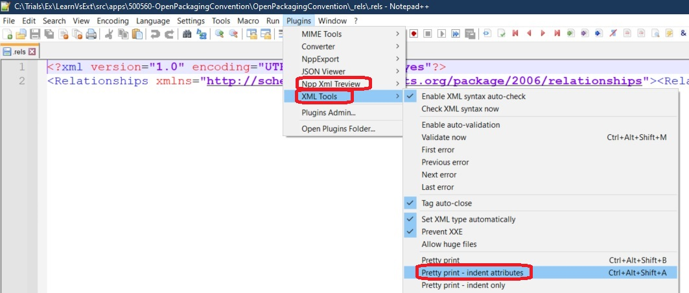

# Understanding Open Packging Convention

1. Create a docx file. An excel file can also be used. If ms office is not installed, just use an existing word document. 

2. OpenPackagingConvention.docx can be used.

3. On my machine, 7z is installed. Right click the Word document and unzip it.

 

4. Now take a look at the files.

5. First consider the file \400560-OpenPackagingConvention\OpenPackagingConvention\_rels\.rels

6. Open that file in note pad plus plus. 

 

7. Ensure NotePad++ has the following plugins to deal with xml files.

 

8. Format the xml files. 

9. The word folder has another _rels folder that contains a file named document.xml.rels. 
This file is also an XML file and defines the part-level relationships. 
This explains the organization of relationships inside the package. Following are the important points to grasp:

• Relationships are defined in the XML file.

• Package-level relationships are defined in the root level _rels folder.

• Part-level relationships are defined in another _rels folder present inside some other folder in the package.

