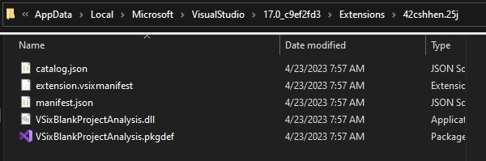

# Some infor about VSix 

1. VSIX stands for **V**isual **S**tudio **I**ntegration E**X**tension

2. A VSIX package is a .vsix file that contains **one or more** Visual Studio extensions. 
    - So can contain more extensions in one package. Not sure how. Need to check

3. In the example 400500-VSixBlankProjectAnalysis, there is vs solution VSixBlankProjectAnalysis.
   - When that is built, a vsix file is created on bin/debug folder. 

4. A vsix file again an OPC package, that is, it follows the Open Packaging Convention.

5. So you can unzip it. 

6. The package is self-describing as it also contains the metadata that Visual Studio uses to
classify and install the extensions. 

7. Manifest and [Content_Types].xml files contain this metadata information. 

8. A VSIX package may also contain one or more of the following:

    - .vsixlangpack files to localize the extension,

    - VSIX packages to install dependencies,

    - Binary file that contains the core functionality of the extensions.

9. A VSIX file is the basic unit of deployment for Visual Studio.

10. Language Packs: A VSIX package may contain once or more Extension.vsixlangpack files to provide
localized text during installation.

11. [Content_Types].xml: As with any OPC file, [Content_Types].xml file identifies the file types contained in the .vsix file or package. 

```xml
<?xml version="1.0" encoding="utf-8"?>
<Types xmlns="http://schemas.openxmlformats.org/package/2006/content-types">
    <Default Extension="vsixmanifest" ContentType="text/xml" />
    <Default Extension="dll" ContentType="application/octet-stream" />
    <Default Extension="pkgdef" ContentType="text/plain" />
    <Default Extension="json" ContentType="application/json" />
</Types>
```

12. Visual Studio installer uses [Content_Types].xml during installation of the package but does not install it. That is why we did not see this file in the install directory.



13. Catalog.json: This is a JSON file generated and packaged inside the VSIX at the time of build. This JSON file contains the manifest and packages information for the extension.

14. The catalog.json file also has "extensionDir". This will indicate where the extension will be installed. 