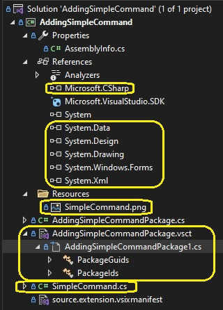
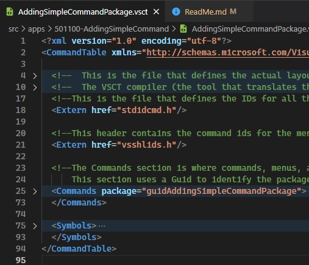
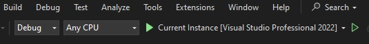
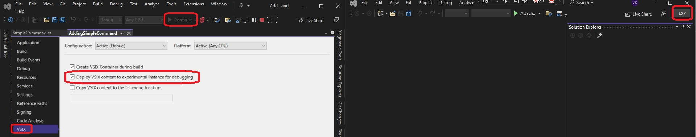

1.  Create a VSix new project.

2.  Add new item as follows.


3. Note before and after adding the command, the changes in the project.

Before


After



So you see quite a few things get added as a result of the new item. 

4. Once you install, open visual studio and you will see the following. 


5. Once clicked, see the following.


6. AddingSimpleCommandPackage.vsct - The file extension vsct stands for **Visual Studio Command Table** - **vsct**

7. XML configuration file that configures the Visual Studio Command Table 

8. Describes the commands that are contained in the VSPackage

9. Controls the layout and appearance of commands.

10. When this configuration file is passed through the VSCT compiler, it converts it into a binary
that is understood by Visual Studio

11. CommandTable element is the root node of the vsct file. The namespace and schema of the vsct is specified as attributes of this element.

12. Whatever is defined in this **command table** is the UI or layout of the commands that the containing VSPackage exposes to the Visual Studio IDE.

13. CommandTable has Extern, Commands, and Symbols as the children



14. **Include**: This element specifies a file that can be included in the current file. 

```xml
<Extern href="stdidcmd.h"/>
```

15. The attribute href is used to refer to the file. All the symbols and types defined in the include file will be part
of the compilation output. For example:

16. In the following image, where does the text **Invoke SimpleCommand** command come from?


17. It comes from the xml file **AddingSimpleCommandPackage.vsct**. See Buttons element. 

18. Launching Visul Studio for trying out. Press the debug button as shown. A new instance of Vs is launched side by side.



19. A new instance of Vs is launched side by side.



20. If you just want to start and run visual studio in experimental mode, run the following command.

```cmc
devenv.exe /RootSuffix Exp ./AddingSimpleCommand.sln
```

21. Now, you can see its installed in the visual studio alone.

22. Now to unstall it, just go to the Extensions(of the experimantal visual studio where you want to uninstall) -> Installed and uninstall it.

20. What if you want to add, a tool tip? 
    1.  Add the following below the buttonText element in the xml file **AddingSimpleCommandPackage.vsct**.
```xml
<ToolTipText>Invoke SimpleCommand Tooltip</ToolTipText>
```

1.   Its not working.


