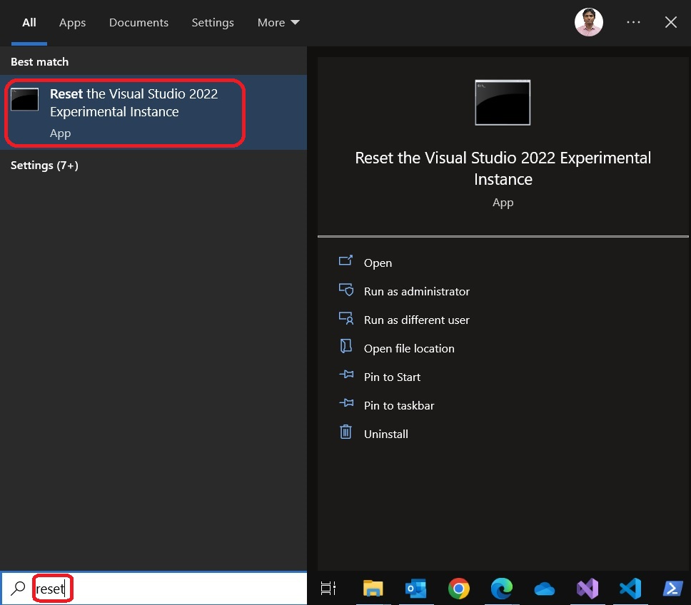

# Demos how to read settings from settings store 

1. This example is similar to the 400650-AddingSimpleCommand. Expands from 400655-ReadVsStoreConfigSettings

2. The project is created exactly same way.

3. This is based on the article [**Writing to the User Settings Store**](https://learn.microsoft.com/en-us/visualstudio/extensibility/writing-to-the-user-settings-store)

4. Visual Studio Setting store is where Visual Studio, during and after installation, stores many of its settings. There is an excellent tool to visualize this. This tool comes in the form of [an extension and can be installed from here](https://marketplace.visualstudio.com/items?itemName=PaulHarrington.SettingsStoreExplorerPreview). For this exercise, **do install this extension**. This is a requirement.

5. Build and Run the project. Look at Tools menu.

6. External Tools

7. Also in the exp instance(not the regular intance of Visual Studio), observe that the Settings Store Explorer is disabled.

8. Enable this extension and close the exp instance. Then start the debugging again. Press F5.

9. Now ensure the extension is enabled.

10. Now open the Setting Store Explorer in the Exp instance of Visual Studio. View -> Other Windows -> Settings Store Explorer. Now look for `External Tools` in Users(see below)

11. Now click the new command Tools -> Invoke WriteToUserSettingsCOmmand.  

12. You should see a message saying Installing Notepad. Now observe again.

13. External Tools After

14. Notice the Settings Store Explorer as well. Invoke Refresh if needed.

15. The key here is the [ShellSettingsManager](https://learn.microsoft.com/en-us/dotnet/api/microsoft.visualstudio.shell.settings.shellsettingsmanager) class. This is the gateway class to reach for the settings stored inside the Visual Studio 

16. If you want to reset the experimental instance, do the following.

