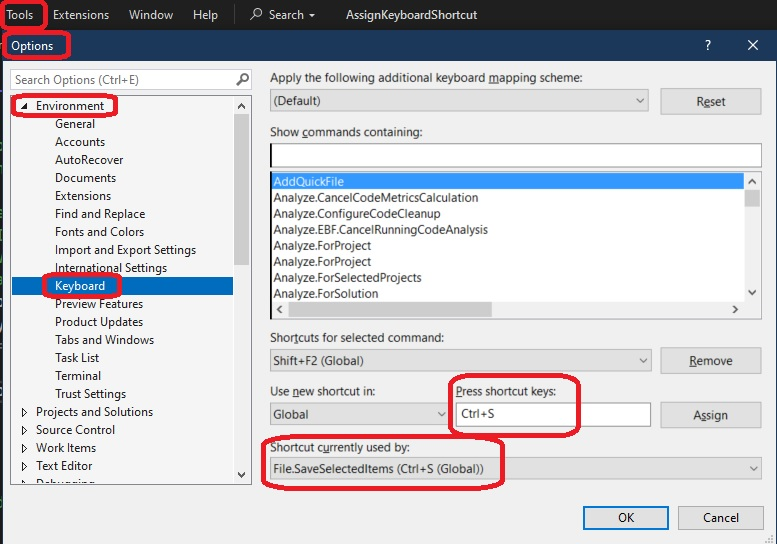

1. Shows how to Assign key board shortcut to a command.

2. Builds on 400650-AddingSimpleCommand. 

3. Create a VSix project in similar steps.

4. Now add the following KeyBindings xml to the vsct file.

```xml
<KeyBindings>
    <KeyBinding guid="guidAssignKeyboardShortcutPackageCmdSet" id="TestCommandId" editor="guidVSStd97" key1="S" mod1="Alt"></KeyBinding>
</KeyBindings>
```

6. Not sure what editor attribute **guidVSStd97** means.

7. In the above KeyBinding, we are assigning Alt + S as the keyboard shortcut.

8. Before assigning the key we need to ensure that keyboard shortcut is not already assigned already not in use. So Tools -> Options -> Keyboard as follows. We see here that Ctrl + S is already assigned. So try Alt + S.



1.   Reference.
   1. https://learn.microsoft.com/en-us/visualstudio/extensibility/keybinding-element#attributes