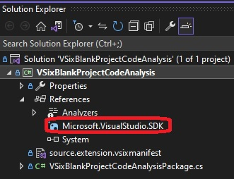
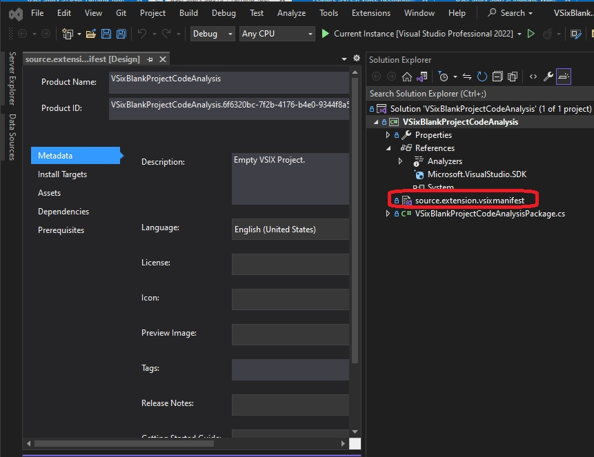
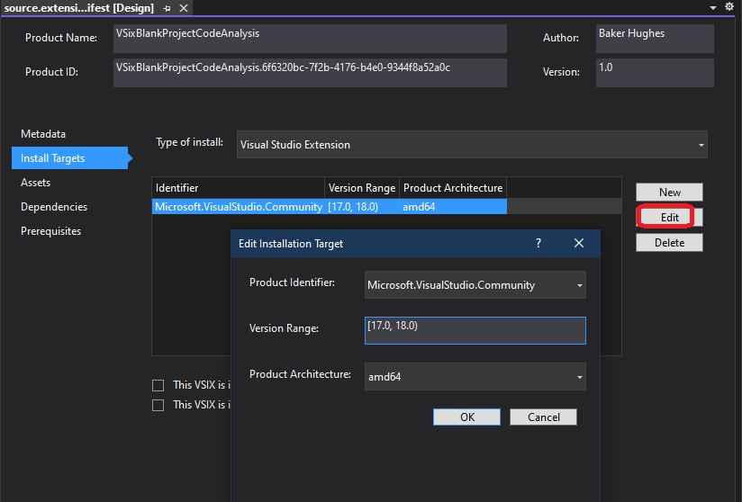
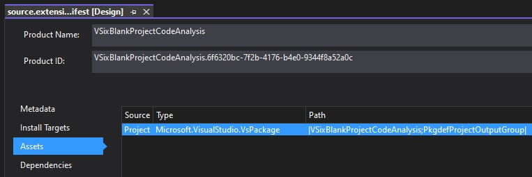

1. This example is similar to the 400500-VSixBlankProjectAnalysis. 

2. The project is created exactly same way.

3. We will be studying the source code

4. Consider the file VSixBlankProjectCodeAnalysisPackage.cs in the project. 

5. The name of this file is of the format {ProjectName}Package.cs. This class implements
the package that would be exposed by the assembly created by building this project.

6. Any class that implements an **IVsPackage** interface and registers itself with the Visual Studio shell satisfies the minimum criteria to be considered a valid Visual Studio package.

7. Microsoft.VisualStudio.Shell.Package used to be the abstract class that one used to derive from to create a valid package. 

8. These days its Async version of it. With Visual Studio 2015, Microsoft introduced the Microsoft.VisualStudio.Shell.AsyncPackage abstract class that derives from Package class.

9. Leveraging this class, we can opt in asynchronous loading of the extension and reduce performance costs and maintain responsiveness of the UI. 

10. In Visual Studio 2019 and above, synchronous loading of extensions is turned off by default so that Visual Studio starts up faster and performs better while launching, as the UI thread is less rigorously used.

11. Note the [Microsoft.VisualStudio.SDK](https://www.nuget.org/packages/microsoft.visualstudio.sdk) nuget package reference. This package is a meta package and contains the Visual Studio Software Development Kit (SDK). When you installed this NuGet package in a stand-alone project, it will bring down 150+ assemblies!!!

Meta package is a special NuGet package that describes a group of packages that makes sense together. For example, Microsoft defined a meta package named Microsoft.NETCore.App, which contains all the NuGet packages that are needed to develop a .NET Core app. Likewise, Microsoft.VisualStudio.SDK is a meta package that groups a number of NuGet packages that are needed to develop extensions to extend Visual Studio.

12. Open the vsix manifest file in Visula Studio by double clicking it.

13. This is where we define the supported Visual Studio version for this product;

| Version | Name               |
|---------|--------------------|
| 8       | Visual Studio 2005 |
| 9       | Visual Studio 2008 |
| 10      | Visual Studio 2010 |
| 11      | Visual Studio 2012 |
| 12      | Visual Studio 2013 |
| 14      | Visual Studio 2015 |
| 15      | Visual Studio 2017 |
| 16      | Visual Studio 2019 |
| 17      | Visual Studio 2022 |

14. Also take a look at the Assets tab, as below.

15. Take a look at this blog post. 
    1.  [Visual Studio extensions and version ranges demystified](https://devblogs.microsoft.com/visualstudio/visual-studio-extensions-and-version-ranges-demystified/)
