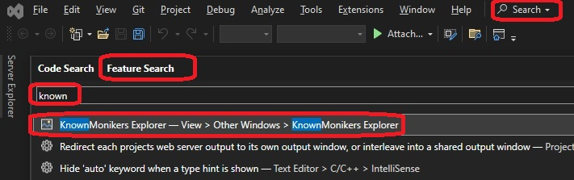
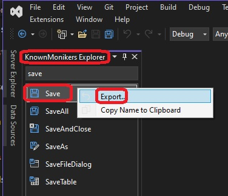
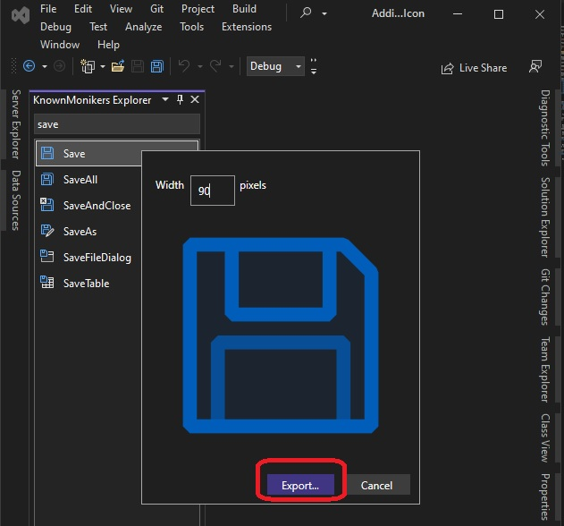
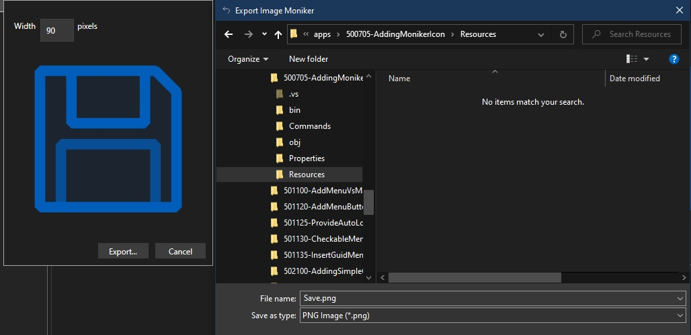
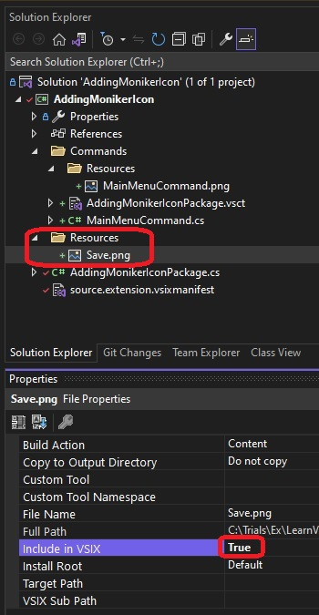
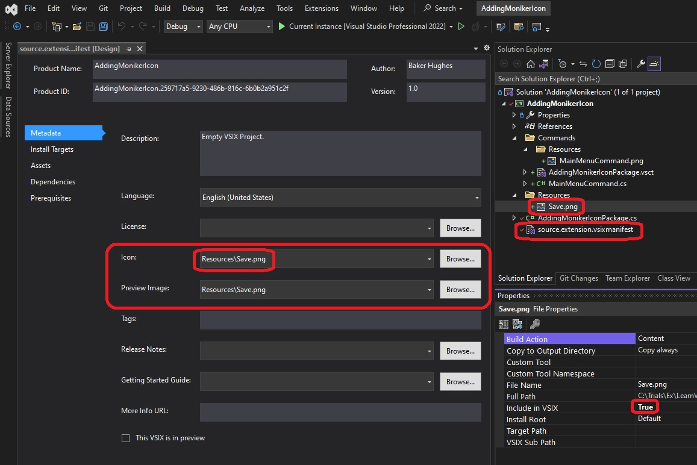
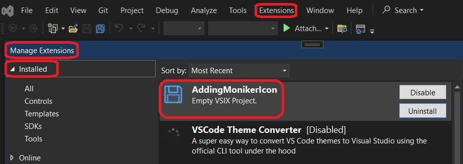
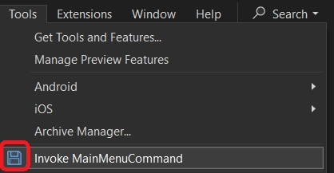

1. Demos how to use existing visual studio moniker icons for the extension.

2. First of all, Visual Studio shipps with thousands of icons.

3. Ensure [Known Monikers Explorer Extension](https://marketplace.visualstudio.com/items?itemName=MadsKristensen.KnownMonikersExplorer2022) is installed. This should be part of [Extensibility Essentials pack](https://marketplace.visualstudio.com/items?itemName=MadsKristensen.ExtensibilityEssentials2022). 

4. Open Visual Studio with or without code. Feature Search(Ctrl + Q) for known monikers. You will see a Known Moniker Explorer Window.



5. You ccan now search for icons. There are many readly available.



6. Lets create a new VSIX package.

7. Add a Commands folder. Then add a command as follows.

 

8. Now open VSCT file, the Visual Studio Command Table file. We dont want to use the default png file. So delete the following. I have commented them in the code.

```xml
<GuidSymbol name="guidImages" value="{532d1e76-0759-4f17-8249-a459c36252f1}" >
    <IDSymbol name="bmpPic1" value="1" />
    <IDSymbol name="bmpPic2" value="2" />
    <IDSymbol name="bmpPicSearch" value="3" />
    <IDSymbol name="bmpPicX" value="4" />
    <IDSymbol name="bmpPicArrows" value="5" />
    <IDSymbol name="bmpPicStrikethrough" value="6" />
</GuidSymbol>
```

and 

```xml
<Bitmaps>
    <Bitmap guid="guidImages" href="Resources\MainMenuCommand.png" usedList="bmpPic1, bmpPic2, bmpPicSearch, bmpPicX, bmpPicArrows, bmpPicStrikethrough"/>
</Bitmaps>
```

and finally 

```xml
<Icon guid="guidImages" id="bmpPic1" />
```

9. Now you can delete the MainMenuCommand.png in the resources folder as well, becuase we are not going to use this any more. I will not be deleting that for this example, I will be keepting it for now. Its no longer used in the app.

10. Next, include the following in the code. By this we are telling the package that we are using the visual studio known moniker icons.

```xml
<Include href="KnownImageIds.vsct"/>
```

11. Now add the following icon tag. So basically we are replacing the above guidImage one with the following.

```xml
<Icon guid="ImageCatalogGuid" id="Save"/>
<CommandFlag>IconIsMoniker</CommandFlag>
```

12. Now its time to add an icon to the extension itself.

13. From the known monikers you can select one, and you can even export, it as png, jpg or gif to any location on the disc.



14. Add it to resources.



15. Then include that file in to the proiect.

16. Next ensure it to be included in VSIX 



17. In the manifest, put this as icon.



18. Now Reset the exp instnace, buid and run.



19.  Also look at the command in the tools menu.



20.  Next. Need to understand 
     1.   [image service tools](https://learn.microsoft.com/en-us/visualstudio/extensibility/internals/image-service-tools)
     2.   Also [image service and catalog](https://learn.microsoft.com/en-us/visualstudio/extensibility/image-service-and-catalog)


