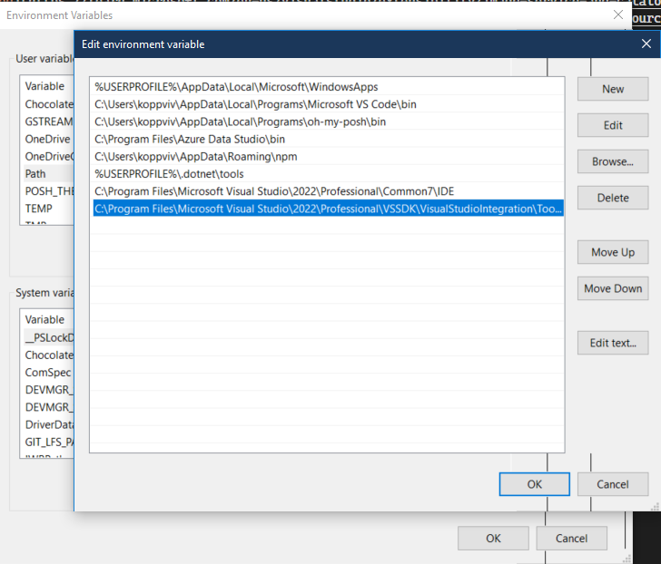
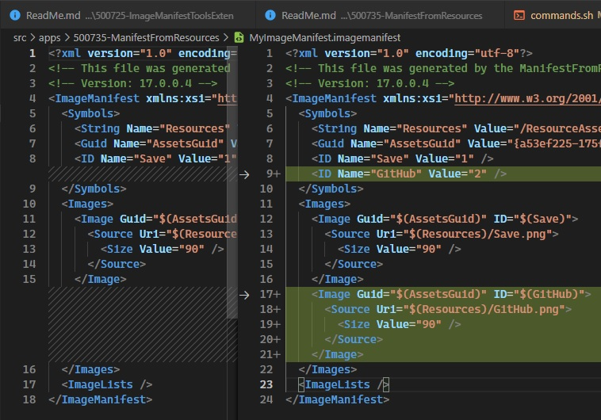

## Introducing Image Manifest Tools Extension

1. References 
   1. [image service tools](https://learn.microsoft.com/en-us/visualstudio/extensibility/internals/image-service-tools)
   2. Also [image service and catalog](https://learn.microsoft.com/en-us/visualstudio/extensibility/image-service-and-catalog)
   3. [Manifest from Resources](https://learn.microsoft.com/en-us/visualstudio/extensibility/internals/manifest-from-resources)

2. Create a new VSIX package. Then add a new folder images. 

3. Then add a png to the images folder. Look at the earlier example(400725-ImageManifestToolsExten). [400725-ImageManifestToolsExten](https://github.com/AvtsVivek/LearnVsExt/tree/main/src/tasks/400705-AddingMonikerIcon)
   1. See the steps how to add a png file. See the following step.
   2. From the known monikers you can select one, and you can even export, it as png, jpg or gif to any location on the disc 

4. Locate the ManifestFromResources.exe on your machine. It should be in the SDK folder as follows.
   1. C:\Program Files\Microsoft Visual Studio\2022\Professional\VSSDK\VisualStudioIntegration\Tools\Bin
   2. C:\Program Files (x86)\Microsoft Visual Studio\2019\Professional\VSSDK\VisualStudioIntegration\Tools\Bin

5. Include this path in the Path environment variable. Go to system properties -> Advanced -> Environment Variables.
   
   

6. Run the following command. 
```cmd
ManifestFromResources /resources:C:/Trials/Ex/LearnVsExt/src/apps/400735-ManifestFromResources/images/Save.png /assembly:ManifestFromResourceAssembly /manifest:MyImageManifest.imagemanifest
```

7. The above command should create a file by the name MyImageManifest.imagemanifest in the folder src/apps/400735-ManifestFromResources

8. Now run the following command. The difference from the above is the assembly. Earlier it was ManifestFromResourceAssembly. Now it is ResourceAssembly 
```cmd
ManifestFromResources /resources:C:/Trials/Ex/LearnVsExt/src/apps/400735-ManifestFromResources/images/Save.png /assembly:ResourceAssembly /manifest:MyImageManifest.imagemanifest
```

9. Now observe the difference in the file MyImageManifest.imagemanifest file.

Before

```xml
  <Symbols>
    <String Name="Resources" Value="/ManifestFromResourceAssembly;Component/images" />
    ...
  </Symbols>
```

After
```xml
  <Symbols>
    <String Name="Resources" Value="/ResourceAssembly;Component/images" />
    ...
  </Symbols>
```

10. Now add one more png file to the images folder.

11. Run the command once more.

```cmd
ManifestFromResources /assembly:ResourceAssembly /manifest:MyImageManifest.imagemanifest /resources:"C:/Trials/Ex/LearnVsExt/src/apps/400735-ManifestFromResources/images/Save.png;C:/Trials/Ex/LearnVsExt/src/apps/400735-ManifestFromResources/images/GitHub.png" 

```

12.  Now observe the imagemanifest file.   
    