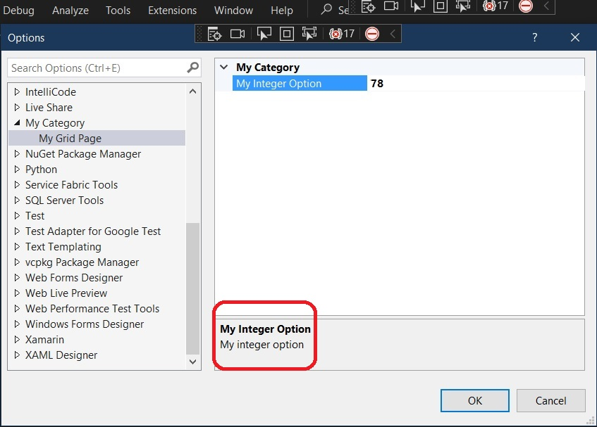
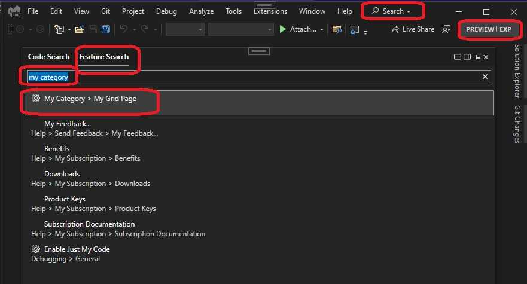

## Introduces DialogPage for Options Grid

1. References 
   1. [Create Options Page](https://learn.microsoft.com/en-us/visualstudio/extensibility/creating-an-options-page)

2. Create a VSIX package. Then add a Package.

3. Create a class like the following derived from DialogPage.
```cs
public class OptionPageGrid : DialogPage
{
   private int optionInt = 256;

   [Category("My Category")]
   [DisplayName("My Integer Option")]
   [Description("My integer option")]
   public int OptionInteger
   {
      get { return optionInt; }
      set { optionInt = value; }
   }
}
```
4. Ensure the attributes to the newly added package are as follows.

```cs
[InstalledProductRegistration("#110", "#112", "1.0", IconResourceID = 400)]
[ProvideMenuResource("Menus.ctmenu", 1)]
[ProvideOptionPage(typeof(OptionPageGrid), "My Category", "My Grid Page", 0, 0, true)]
[PackageRegistration(UseManagedResourcesOnly = true, AllowsBackgroundLoading = true)]
[Guid(MyToolsOptionsPackage.PackageGuidString)]
[SuppressMessage("StyleCop.CSharp.DocumentationRules", "SA1650:ElementDocumentationMustBeSpelledCorrectly", Justification = "pkgdef, VS and vsixmanifest are valid VS terms")]
public sealed class MyToolsOptionsPackage : AsyncPackage
{ ... }
```

5. Build the project and start debugging.

6. In the experimental instance of Visual Studio, on the Tools menu click Options.

7. In the left pane, you should see **My Category**. (Options categories are listed in alphabetical order, so it should appear about halfway down the list.) Open **My Category** and then click **My Grid Page**. The options grid appears in the right pane. The property category is **My Category**, and the property name is **My Integer Option**. The property description, **My integer option**, appears at the bottom of the pane. Change the value from its initial value of 256 to something else. Click OK, and then reopen My Grid Page. You can see that the new value persists.



Your options page is also available through Visual Studio's search box. In the search box near the top of the IDE, type **My Category** and you'll see **My Category** -> **My Grid Page** listed in the results.



8. Also note, you can remove the CreateOptionsPagePackage file. For this example, we have added MyToolsOptionsPackage and only this is used. Add Ctors for both of the two classes. Also add in Ctor as well as InitializeAsync(). 

```cs
Debugger.Break();
```

9. Now build, run and check. The Break() method in CreateOptionsPagePackage is never hit. This shows that this file can be removed.

10. Finally, you dont have to add a new package, just as we added **MyToolsOptionsPackage**. We can use the existing one instead. CreateOptionsPagePackage. Just ensure the attributes are added as shown above. 