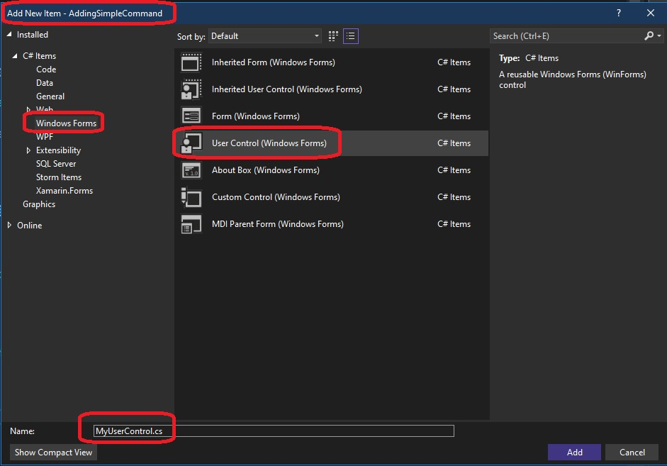
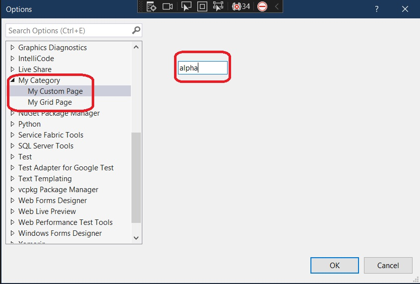

## Introduces DialogPage for Options Grid with string option

1. References 
   1. [Create a Tools Options custom page](https://learn.microsoft.com/en-us/visualstudio/extensibility/creating-an-options-page#create-a-tools-options-custom-page)

2. This is similar to earlier example 400800-CreateOptionsPage

3. In this example, we will not be adding another package as in the earlier example(400800-CreateOptionsPage). But instead we will be using the existing package class created by default when we use the VSixPackage template to create the project.  

4. Create a VSIX package project similar to earlier examples. Then add the following class to the project.
```cs
public class OptionPageGrid : DialogPage
{
    private int optionInt = 256;

    [Category("My Category")]
    [DisplayName("My Integer Option")]
    [Description("My integer option")]
    public int OptionInteger
    {
        get { return optionInt; }
        set { optionInt = value; }
    }
}
```

Note that the attributes added are optional. Try commenting out and then running again. Its working.

```cs
// [Category("My Category")]
// [DisplayName("My Integer Option")]
// [Description("My integer option")]
```

5. Next ensure the following attributes decoreate the package class.

```cs
[PackageRegistration(UseManagedResourcesOnly = true, AllowsBackgroundLoading = true)]
[Guid(ToolsOptionsCustomPagePackage.PackageGuidString)]
[InstalledProductRegistration("#110", "#112", "1.0", IconResourceID = 400)]
[ProvideMenuResource("Menus.ctmenu", 1)]
[ProvideOptionPage(typeof(OptionPageGrid),
"My Category", "My Grid Page", 0, 0, true)]
public sealed class ToolsOptionsCustomPagePackage : AsyncPackage
{}
```

6. Now build and run. Till this point, this is same as earlier example. 

7. Add a new class OptionPageCustom which derives from DialogPage. 
```cs
[Guid("00000000-0000-0000-0000-000000000000")]
public class OptionPageCustom : DialogPage
{
    private string optionValue = "alpha";

    public string OptionString
    {
        get { return optionValue; }
        set { optionValue = value; }
    }

    protected override IWin32Window Window
    {
        get
        {
            var userControl = new MyUserControl();
            userControl.optionsPage = this;
            userControl.Initialize();
            return userControl;
        }
    }
}
```

8. Add a windows Forms user control named MyUserControl. So right click project, Add -> New Item -> Win Forms User Control.



9.  Then add a textbox control to it. Add a text changed event and handler to this textbox. Note the leave event as mentioned in the above reference is not working. So here text changed is tried and its working.
```cs
public partial class MyUserControl : UserControl
{
   public MyUserControl()
   {
      InitializeComponent();
   }

   internal OptionPageCustom optionsPage;

   public void Initialize()
   {
      textBox1.Text = optionsPage.OptionString;
   }

   private void textBox1_TextChanged(object sender, EventArgs e)
   {
      optionsPage.OptionString = textBox1.Text;
   }
}
```

10.  Finally add the following attribute to the package class.
```cs
[ProvideOptionPage(typeof(OptionPageCustom), "My Category", "My Custom Page", 0, 0, true)]
```

11.   Now build and Press F5 to start debugging. In the Exp Vs intance, Tools -> Options -> My Category observe.



12. Changes that text and reopen the visual studio. 

