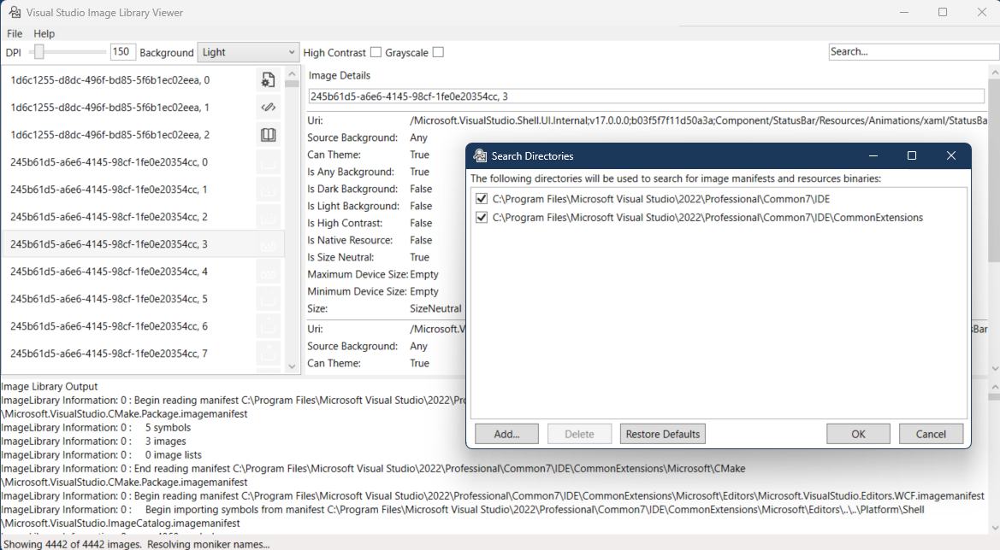

## Notes

1. The Visual Studio Image Library Viewer Tool's location is here. "C:\Program Files\Microsoft Visual Studio\2022\Professional\VSSDK\VisualStudioIntegration\Tools\Bin\ImageLibraryViewer\ImageLibraryViewer.exe"

2. Click File -> Set Paths

3. Here we go..

## References
1. Visual Studio Image Library - Free icons 🖼️ #vslive #tipsandtricks #visualstudio
   1. https://www.youtube.com/watch?v=vRcXK9yhB1k

2. https://learn.microsoft.com/en-us/answers/questions/2115600/visual-studio-image-library-viewer-tool-does-not-s

3. https://learn.microsoft.com/en-us/answers/questions/2115462/where-to-download-visual-studio-image-library-view

4. 