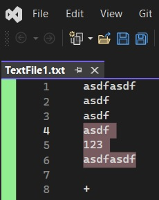
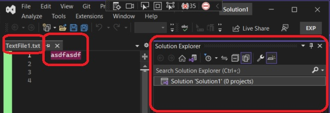

# Customizing the text view

## Reference: 
1. https://learn.microsoft.com/en-us/visualstudio/extensibility/walkthrough-customizing-the-text-view
2. https://learn.microsoft.com/en-us/dotnet/api/microsoft.visualstudio.text.editor.iwpftextview
3. https://learn.microsoft.com/en-us/visualstudio/extensibility/inside-the-editor

## How this project is created. 
1. Create a VSix project.

2. Add Editor Classifier new item. Then delete the files. This adds some necessary references to the project.


3. Then add the class **TestViewCreationListener**.

4. Build and run. 

## Notes

1. Just select a text, it should be light pink. 



2. Once the exp instance is launched, open a text(TextFile1.txt for example) file. It has a text "asdfasdf".



3. Select that text and then click on the solution explorer. You will see that the selection gets pink. 

4. Now, click on the code window, ensure no text is selected, then Edit -> Advanced -> View White Space. Checkout for the keyboard shortcut Ctrl + R, Ctrl + W. This also works to toggle View White Space.


5. Now press some tabs. You should now see them as red arrows.


6. So this is working with text file. Note the ContentType attribute with "text" as parameter. 

7. I tried with "code", "CSharp" etc. Nothing worked. Not sure why.  

```cs
[ContentType("code")]
```

8. Also note the left margin is light green. 

9. Not clear what the following is doing. I tried changing the color of the caret, but it did not seem to work. So leaving the following aside.

```cs
regularCaretProperties[EditorFormatDefinition.ForegroundBrushId] = Brushes.Magenta;
formatMap.SetProperties("Caret", regularCaretProperties);

overwriteCaretProperties[EditorFormatDefinition.ForegroundBrushId] = Brushes.Turquoise;
formatMap.SetProperties("Overwrite Caret", overwriteCaretProperties);
```
