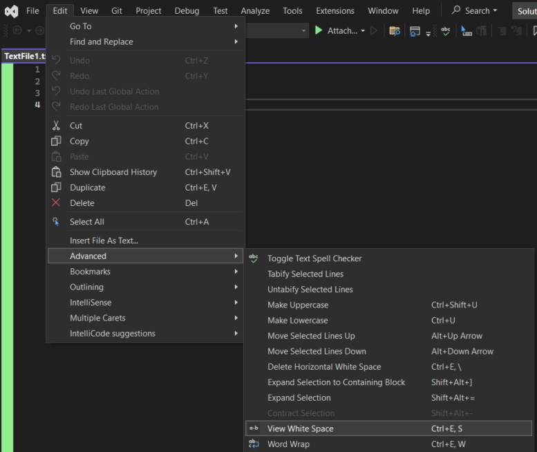

# Customizing the text view

## Reference: 
1. https://learn.microsoft.com/en-us/visualstudio/extensibility/walkthrough-customizing-the-text-view

## How this project is created. 
1. Started from the sdk style project from 400510-VSixSdkProjectIntro.

2. Added necessary references, such as presentation core etc.

3. Then add the class **TestViewCreationListener**.

4. Build and run. 

## Notes
1. Once the exp instance is launched, open a text(TextFile1.txt for example) file. It has a text "asdfasdf".


2. Select that text and then click on the solution explorer. You will see that the selection gets pink. 

3. Now, click on the code window, ensure no text is selected, then Edit -> Advanced -> View White Space.



4. Now press some tabs. You should now see them as red arrows.


5. So this is working with text file. Note the ContentType attribute with "text" as parameter. 

6. I tried with "code", "CSharp" etc. Nothing worked. Not sure why.  

```cs
[ContentType("code")]
```

7. 