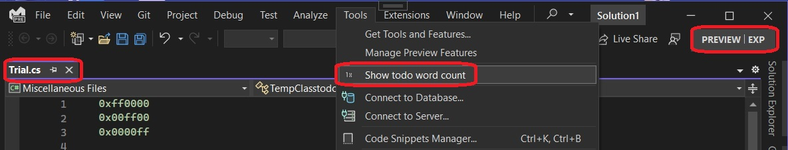
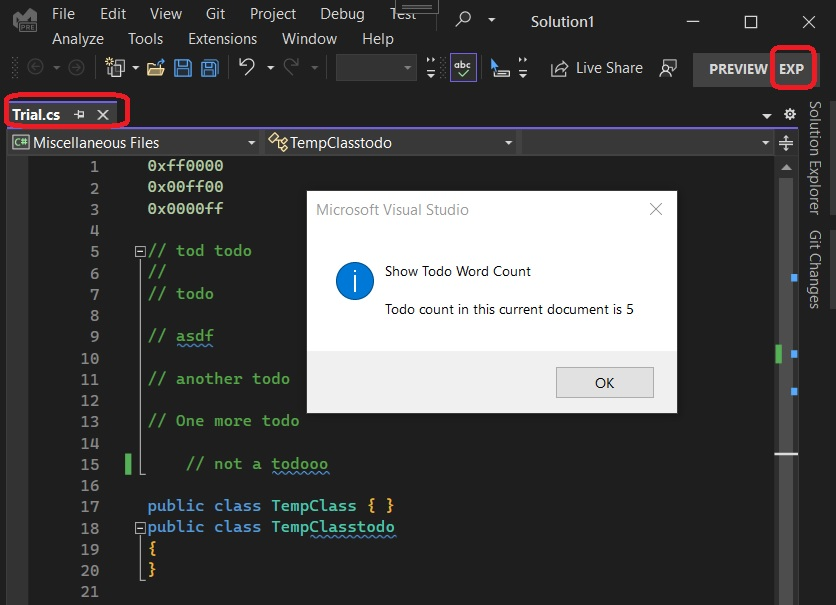

## Objective 

1. Introduces **ITag** and **ITagger**.

2. Also introduces **Span**, **Classifier** etc. 

3. Open a text file in Visual Studio. Then by invoking a command, can we get a count of any specific word(a tag, let that be **todo** for this case) be shown in a message box? Note we are not intrested in how this todo is displayed in the editor. Like we are not talking about adornments, highlighting etc. Thoese will be next steps. So are not going into Text View Subsystem. We will stick to Text Model Subsystem only. 

4. The text buffer belongs to the text model subsystem and not text view subsystem(hope I am not wrong here). This buffer can be manipulated, versioned etc, but cannot be displayed. A view consumes this buffer to show it in the editor.

5. So back to the question, how to get the word count of a given word(todo)? One way is to use the DTE to get to the document, read it and scan for the word in question.

6. But can we use the concept of tagging here?

## Notes
1. What is a **Span**. A [span is a continuous piece of text](https://learn.microsoft.com/en-us/visualstudio/extensibility/inside-the-editor#spans-and-normalizedspancollections).

## Build and Run

1. Open any text file which has some todo in it.



2. The count we can see.



3. We have TodoTagger.cs. In it, we have code to filter comment as follows. If we remove the following, then the number of todo will be 6 instead of 5. 

```cs
//if the classification is a comment
if (classificationSpan.ClassificationType.Classification.ToLower().Contains("comment"))
{
    ...
}
```

4. So how does it work? Here it is.

5. First, as usual, we need to bet the text manager. If you remember from earlier example(402500-VsTextManagerIntro), text manager helps get the current view, if any file is currently opened in visual studio.
```cs
var vsTextManager = GetGlobalService<IVsTextManager>(typeof(SVsTextManager));
```
The GetGlobalService private methods gets the service from Package.GetGlobalService static method.

6. Next we get the active view, if any file is opened in Visual Studio editor.
```cs
vsTextManager.GetActiveView(1, null, out IVsTextView vsTextView);
```

7. Next we need component model object. The IComponentModel object can help us get the MEF services as we need them. Take a look at 402600-ComponentModelIntro example.
```cs
var componentModel = GetGlobalService<IComponentModel>(typeof(SComponentModel));
```

8. Import an **IVsEditorAdaptersFactoryService** to map between legacy TextManager code and editor code 
```cs
var vsEditorAdaptersFactoryService = componentModel.GetService<IVsEditorAdaptersFactoryService>();
```

9. Get IClassifierAggregatorService object to get classifier. We need to explore more about the classifier. 
```cs
var classifierAggregatorService = componentModel.GetService<IClassifierAggregatorService>();
```

10. Now that we have adapter, we can get the wpfTextView from the vsTextView. See 402800-WpfTextViewIntro. IWpfTextView belongs to [Text View Subsystem](https://learn.microsoft.com/en-us/visualstudio/extensibility/inside-the-editor#text-view-subsystem). 

```cs
var wpfTextView = vsEditorAdaptersFactoryService.GetWpfTextView(vsTextView);
```

11. Now what we need to get into is [Text Model Subsystem](https://learn.microsoft.com/en-us/visualstudio/extensibility/inside-the-editor#text-model-subsystem). The text buffer is what we need now. We will get the classifier from the text buffer. The tagger needs classifier. We need to exlore more about classifiers.

```cs
var classifier = classifierAggregatorService.GetClassifier(wpfTextView.TextBuffer);

var todoTagger = new TodoTagger(classifier);
```

12. From the buffer get the current snapshot. We need to exlore more about diffrent versions and snapshots.

```cs
var currentTextSnapShot = wpfTextView.TextBuffer.CurrentSnapshot;

var currentSnapShotSpan = new Span(0, currentTextSnapShot.Length);

var normalizedSnapshotSpanCollection = new NormalizedSnapshotSpanCollection(currentTextSnapShot, currentSnapShotSpan);
```

13. Finally we get the **todo** tag list from the tagger as follows. 

```cs
var tagList = todoTagger.GetTags(normalizedSnapshotSpanCollection).ToList();
```


