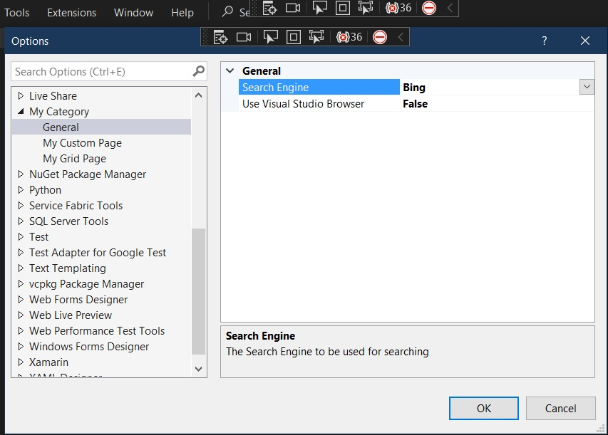
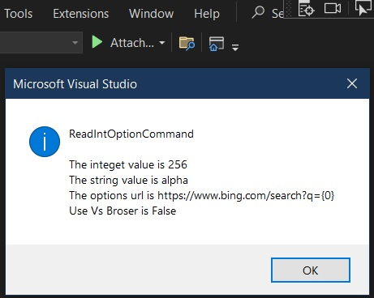

# Demos Reading of Options values. 

1. Then uses these values in the extension code to show them when a command is executed

2. Builds on earlier example, 400800-CreateOptionsPage and 400810-ToolsOptionsCustomPage

3. Now add a command. But this is not resulting a vsct file. We need to author or create a visual studio command table, vsct. So we have to follow
   1. https://learn.microsoft.com/en-us/visualstudio/extensibility/internals/visual-studio-command-table-dot-vsct-files
   2. https://learn.microsoft.com/en-us/visualstudio/extensibility/internals/authoring-dot-vsct-files
   3. https://learn.microsoft.com/en-us/visualstudio/extensibility/internals/how-to-create-a-dot-vsct-file

4. Instead of authoring vsct file ourselves, we take the other alternative.

5. In this other alternative, we will start with a VSix project, then add a command. Then add a dialog page.

6. In the package, add the following two properties which will make available the values of the options dialog pages.

   ```cs
   public int OptionInteger
   {
      get
      {
            var optionPageGrid = (OptionPageGrid)GetDialogPage(typeof(OptionPageGrid));
            return optionPageGrid.OptionInteger;
      }
   }

   public string OptionTextString
   {
      get
      {
            var optionPageCustom = (OptionPageCustom)GetDialogPage(typeof(OptionPageCustom));
            return optionPageCustom.OptionString;
      }
   }
   ```

7. Now you can use them in the command as follows.

   ```cs
   string message = $"The integet value is {readOptionsValuesPackage.OptionInteger}";
   message = message + Environment.NewLine;
   message = message + $"The string value is {readOptionsValuesPackage.OptionTextString}";
   ```

8. Build and run. In the Exp instance Tools -> Options -> My Category. Change the values in My Grid Page and My Custom Page. Restart the Exp instance. Now execute the command. Ovserve the values.

9. Also add ExternalSearchOptionPage and also register the same with the package as follows.

   ```cs
   [ProvideOptionPage(typeof(ExternalSearchOptionPage), "My Category", "General", 1, 1, true, new string[] { "External Search Options" })]
   ```

10. Build and Run
   


11.  Tools Options
   


12. If you want to reset the experimental instance, do the following.


## References

1. [Create a Tools Options custom page](https://learn.microsoft.com/en-us/visualstudio/extensibility/creating-an-options-page#create-a-tools-options-custom-page)

2. https://learn.microsoft.com/en-us/visualstudio/extensibility/internals/visual-studio-command-table-dot-vsct-files

3. https://learn.microsoft.com/en-us/visualstudio/extensibility/internals/authoring-dot-vsct-files

4. https://learn.microsoft.com/en-us/visualstudio/extensibility/internals/how-to-create-a-dot-vsct-file

