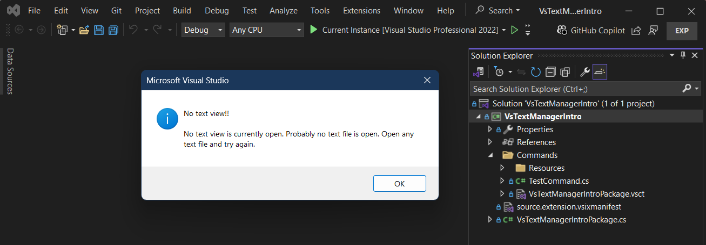
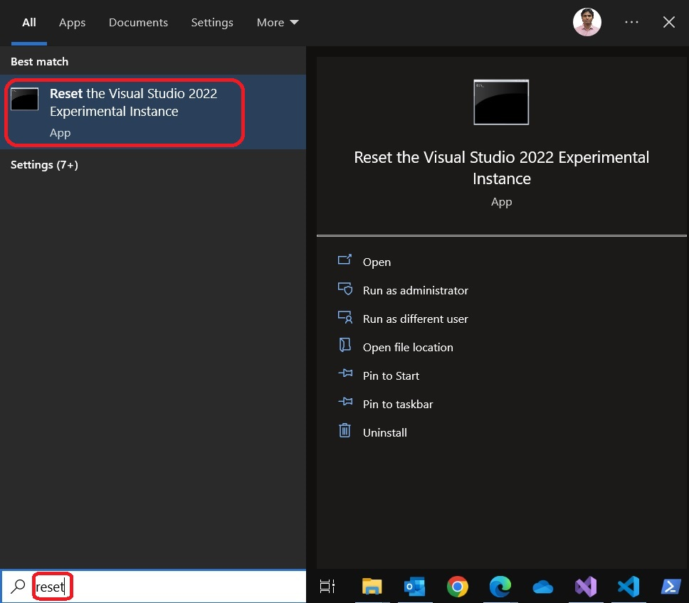

## Objective

1. Introduces **IVsTextManager** and SVsTextManager.

2. This also introduces [subsystems inside Visual Studio Editor](https://learn.microsoft.com/en-us/visualstudio/extensibility/inside-the-editor#overview-of-the-subsystems).

## Introduction

1. There are 4 subsystems in Visual Studio editor. 

   1. [Text Model Subsystem.](https://learn.microsoft.com/en-us/visualstudio/extensibility/inside-the-editor#text-model-subsystem). The text model subsystem is responsible for representing text and enabling its manipulation. The text model subsystem contains the ITextBuffer interface, which describes the sequence of characters that is to be displayed by the editor.
   
   2. [Text View Subsystem](https://learn.microsoft.com/en-us/visualstudio/extensibility/inside-the-editor#text-view-subsystem). The text view subsystem is responsible for formatting and displaying text.

   3. [Classification Subsystem](https://learn.microsoft.com/en-us/visualstudio/extensibility/inside-the-editor#classification-subsystem). The classification subsystem is responsible for determining font properties for text. A classifier breaks the text into different classes, for example, **keyword** or **comment**.
   
   4. [Operations Subsystem](https://learn.microsoft.com/en-us/visualstudio/extensibility/inside-the-editor#operations-subsystem). The operations subsystem defines editor behavior. It provides the implementation for Visual Studio editor commands and the undo system.

2. You can get **IVsTextView** object from **IVsTextManager**. **IVsTextView** represents the [Text View Subsystem](https://learn.microsoft.com/en-us/visualstudio/extensibility/inside-the-editor#text-view-subsystem).

```cs
vsTextManager.GetActiveView(mustHaveFocus, null, out IVsTextView vsTextView);
```

3. So here, from the text manager, we get the text view. 

4. Then from the text view, we get buffer. The buffer is what the [Text Model Subsystem](https://learn.microsoft.com/en-us/visualstudio/extensibility/inside-the-editor#text-model-subsystem) we discussed earlier.

5. The buffer is represented by the interface **IVsTextLines**. This has lot of information about the text in the file.

```cs
vsTextView.GetBuffer(out IVsTextLines currentDocTextLines);
```

5. The you can cast **IVsTextLines** to **IVsTextBuffer** as well.

```cs
var vsTextBuffer = currentDocTextLines as IVsTextBuffer;
```

6. You can get a lot of data in the file from **IVsTextBuffer** object.

7. The **vsTextBuffer** object also impliments **IPersistFileFormat**, so you can get the full file path as well.

```cs
var persistFileFormat = vsTextBuffer as IPersistFileFormat;

persistFileFormat.GetCurFile(out string filePath, out uint pnFormatIndex);
```

8. Also you can also get IWpfTextViewHost and IWpfTextView objects as well. There are other methods to get these objects as well. But this is not the subject of this example.  

## Build and Run.
1. Build and launch the exp instance of without any file or solution opened in it. Then Tools -> Invoke Test Command.



2. Now open a file with a few lines of text, for simplicity, open a completely blank text file. 

3. If you want to reset the experimental instance, do the following.



## Reference.
1. https://stackoverflow.com/questions/76888423/

2. https://learn.microsoft.com/en-us/dotnet/api/microsoft.visualstudio.textmanager.interop.ivstextmanager

3. https://learn.microsoft.com/en-us/visualstudio/extensibility/inside-the-editor
