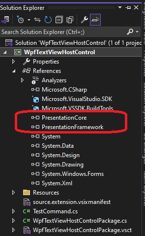

## Objective

1. Introduces **WpfTextViewHost** 

2. You need to add wpf references for this to work. 



3. Both the following gives the exact same type. Not sure why

```cs
IWpfTextViewHost wpfTextViewHost = (IWpfTextViewHost)holder;
var wpfTextViewHostType = wpfTextViewHost.GetType();
var hostControlType = wpfTextViewHost.HostControl.GetType();
```

4. The `IWpfTextViewHost` will explored more in the subsequent examples.

5. 

