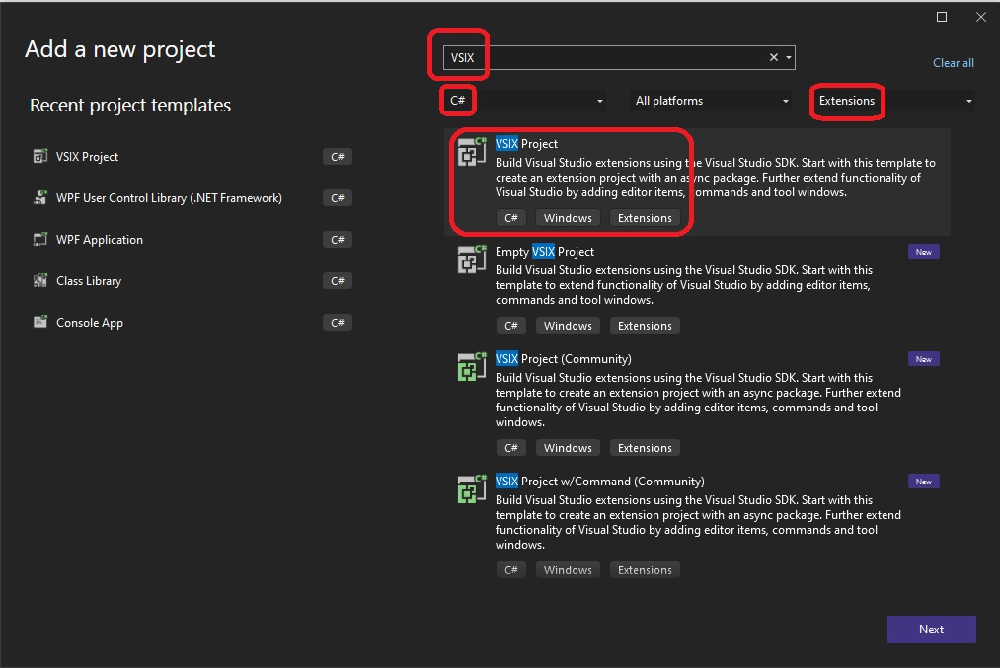
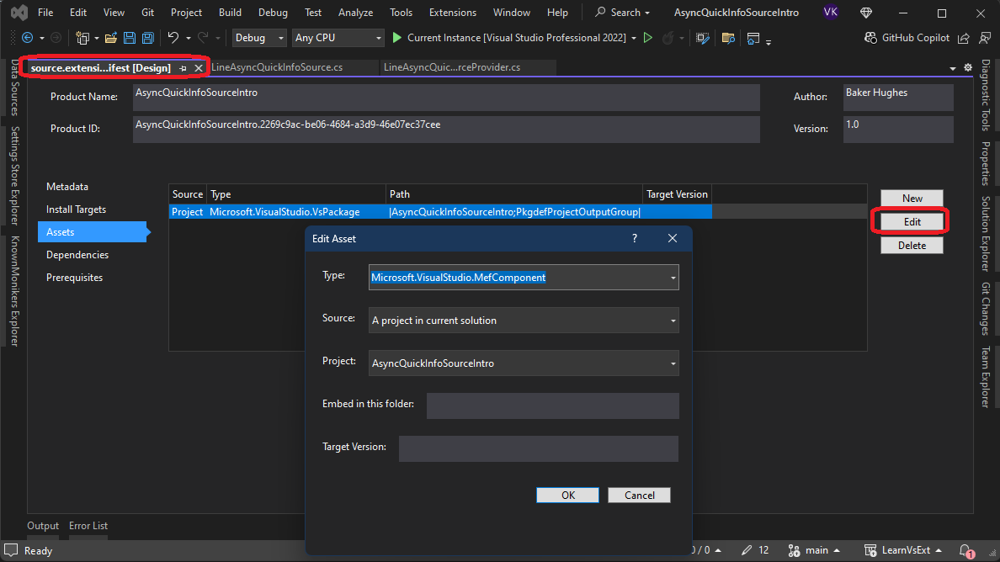
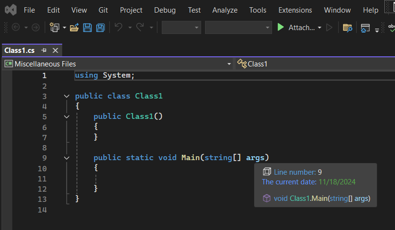
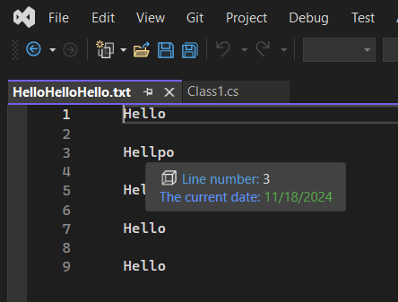

## How this project is created.
1. Follow the steps mentioned in VSixBlankProjectAnalysis example earlier.

2. Create a new project as follows.

3. Make it a Mef Component as follows. Solution Explorer -> Look for source.extension.vsixmanifest, right click -> Assets -> Edit.

4. Add the two classes, `LineAsyncQuickInfoSource` and its provided, `LineAsyncQuickInfoSourceProvider`

## Build and Run.
1. First Reset VS Exp instance.

2. Do a full rebuild.

3. Press F5 to run. Open any file like the following. Hower the mouse so a quick info is displayed as follows.

4. The text file.

## Notes

1. Without making it into an MEF component, this is not working. Need to undrestand more about MEF component. 

## References
1. https://github.com/microsoft/VSSDK-Extensibility-Samples/tree/master/AsyncQuickInfo
2. https://learn.microsoft.com/en-us/visualstudio/extensibility/managed-extensibility-framework-in-the-editor
3. https://github.com/Microsoft/vs-editor-api/wiki/Modern-Quick-Info-API
4.  